# Diagramas de Casos de Uso

## Descripción General

Este documento presenta los diagramas de casos de uso para todos los roles del sistema Bellydance Project. Los casos de uso describen las interacciones entre los actores (usuarios) y el sistema, mostrando las funcionalidades disponibles para cada rol.

## Actores del Sistema

- **Administrador (ADMIN)**: Tiene control total del sistema
- **Directora Académica (DIRECTORA_ACADEMICA)**: Gestiona aspectos académicos y logísticos
- **Profesora (PROFESORA)**: Imparte clases y gestiona contenido artístico
- **Alumna (ALUMNA)**: Estudiante que participa en las clases

## Diagrama General de Casos de Uso

```mermaid
graph TB
    subgraph "Actores"
        Admin[Administrador]
        Directora[Directora Académica]
        Profesora[Profesora]
        Alumna[Alumna]
    end

    subgraph "Casos de Uso Compartidos"
        CU_Login[Iniciar Sesión]
        CU_Logout[Cerrar Sesión]
        CU_Recovery[Recuperar Contraseña]
        CU_Profile[Ver Perfil]
    end

    subgraph "Casos de Uso de Administrador"
        CU_A_Users[Gestionar Usuarios]
        CU_A_Enrollments[Gestionar Inscripciones]
        CU_A_Students[Lista de Alumnas Inscritas]
        CU_A_Classification[Clasificación Académica]
        CU_A_Documents[Gestionar Documentos]
        CU_A_Payments[Controlar Pagos]
        CU_A_Reports[Generar Reportes]
        CU_A_Schedules[Gestionar Horarios]
    end

    subgraph "Casos de Uso de Directora"
        CU_D_Events[Gestionar Eventos]
        CU_D_Attendance[Controlar Asistencias]
        CU_D_Enrollments[Revisar Inscripciones]
        CU_D_Students[Lista de Alumnas Inscritas]
        CU_D_Reports[Ver Reportes Académicos]
        CU_D_Schedules[Visualizar Horarios]
    end

    subgraph "Casos de Uso de Profesora"
        CU_P_Classes[Gestionar Contenido de Clases]
        CU_P_Attendance[Registro de Asistencia]
        CU_P_Evaluations[Evaluaciones]
        CU_P_Choreographies[Gestionar Coreografías]
        CU_P_Costumes[Gestionar Vestuarios]
        CU_P_Schedules[Visualizar Horarios]
        CU_P_Students[Ver Alumnas por Categorías]
    end

    subgraph "Casos de Uso de Alumna"
        CU_S_Register[Registrarse]
        CU_S_Enroll[Inscribirse a Clases]
        CU_S_MyEnrollments[Mis Inscripciones]
        CU_S_Classes[Ver Clases]
        CU_S_Choreographies[Ver Coreografías]
        CU_S_Costumes[Ver Vestuarios]
        CU_S_Form[Planilla de Inscripción]
    end

    %% Conexiones de casos compartidos
    Admin --> CU_Login
    Directora --> CU_Login
    Profesora --> CU_Login
    Alumna --> CU_Login

    Admin --> CU_Logout
    Directora --> CU_Logout
    Profesora --> CU_Logout
    Alumna --> CU_Logout

    Admin --> CU_Recovery
    Directora --> CU_Recovery
    Profesora --> CU_Recovery
    Alumna --> CU_Recovery

    %% Conexiones de Administrador
    Admin --> CU_A_Users
    Admin --> CU_A_Enrollments
    Admin --> CU_A_Students
    Admin --> CU_A_Classification
    Admin --> CU_A_Documents
    Admin --> CU_A_Payments
    Admin --> CU_A_Reports
    Admin --> CU_A_Schedules

    %% Conexiones de Directora
    Directora --> CU_D_Events
    Directora --> CU_D_Attendance
    Directora --> CU_D_Enrollments
    Directora --> CU_D_Students
    Directora --> CU_D_Reports
    Directora --> CU_D_Schedules

    %% Conexiones de Profesora
    Profesora --> CU_P_Classes
    Profesora --> CU_P_Attendance
    Profesora --> CU_P_Evaluations
    Profesora --> CU_P_Choreographies
    Profesora --> CU_P_Costumes
    Profesora --> CU_P_Schedules
    Profesora --> CU_P_Students

    %% Conexiones de Alumna
    Alumna --> CU_S_Register
    Alumna --> CU_S_Enroll
    Alumna --> CU_S_MyEnrollments
    Alumna --> CU_S_Classes
    Alumna --> CU_S_Choreographies
    Alumna --> CU_S_Costumes
    Alumna --> CU_S_Form

    %% Estilos
    style Admin fill:#ffcccc
    style Directora fill:#ffebcc
    style Profesora fill:#ccffcc
    style Alumna fill:#e6ccff
```

## Casos de Uso del Administrador

```mermaid
graph TD
    Admin[Administrador]
    CU1[Gestionar Usuarios]
    CU2[Gestionar Inscripciones]
    CU3[Lista de Alumnas Inscritas]
    CU4[Clasificación Académica]
    CU5[Gestionar Documentos]
    CU6[Controlar Pagos]
    CU7[Generar Reportes]
    CU8[Gestionar Horarios]
    
    Admin --> CU1
    Admin --> CU2
    Admin --> CU3
    Admin --> CU4
    Admin --> CU5
    Admin --> CU6
    Admin --> CU7
    Admin --> CU8
    
    CU1 --> CU1_1[Registrar Nuevo Usuario]
    CU1 --> CU1_2[Ver Lista de Usuarios]
    CU1 --> CU1_3[Asignar Rol]
    CU1 --> CU1_4[Editar Usuario]
    CU1 --> CU1_5[Eliminar Usuario]
    
    CU2 --> CU2_1[Ver Inscripciones]
    CU2 --> CU2_2[Aprobar Inscripción]
    CU2 --> CU2_3[Rechazar Inscripción]
    CU2 --> CU2_4[Agregar Nota de Revisión]
    CU2 --> CU2_5[Asignar Nivel Académico]
    CU2 --> CU2_6[Filtrar por Estado]
    
    CU3 --> CU3_1[Ver Alumnas Aprobadas]
    CU3 --> CU3_2[Ver por Categoría de Edad]
    CU3 --> CU3_3[Ver por Nivel Académico]
    CU3 --> CU3_4[Reubicar Alumna de Nivel]
    CU3 --> CU3_5[Filtrar y Buscar]
    CU3 --> CU3_6[Ver Detalles de Alumna]
    
    CU4 --> CU4_1[Ver Estadísticas por Categoría]
    CU4 --> CU4_2[Ver Estadísticas por Nivel]
    CU4 --> CU4_3[Ver Distribución Combinada]
    CU4 --> CU4_4[Ver Métricas de Clasificación]
    
    CU5 --> CU5_1[Recibir Documentos]
    CU5 --> CU5_2[Revisar Documentos]
    CU5 --> CU5_3[Entregar Documentos]
    CU5 --> CU5_4[Ver Historial de Documentos]
    CU5 --> CU5_5[Actualizar Estado de Documento]
    
    CU6 --> CU6_1[Registrar Pagos]
    CU6 --> CU6_2[Ver Historial de Pagos]
    CU6 --> CU6_3[Generar Reporte de Pagos]
    CU6 --> CU6_4[Ver Pagos por Alumna]
    CU6 --> CU6_5[Generar Recibo]
    
    CU7 --> CU7_1[Ver Métricas de Usuarios]
    CU7 --> CU7_2[Ver Métricas de Inscripciones]
    CU7 --> CU7_3[Ver Métricas de Pagos]
    CU7 --> CU7_4[Ver Métricas de Clasificación]
    CU7 --> CU7_5[Exportar CSV]
    CU7 --> CU7_6[Ver Reportes Detallados]
    
    CU8 --> CU8_1[Crear Horario]
    CU8 --> CU8_2[Ver Horarios]
    CU8 --> CU8_3[Editar Horario]
    CU8 --> CU8_4[Eliminar Horario]
    CU8 --> CU8_5[Filtrar por Categoría]
    CU8 --> CU8_6[Filtrar por Nivel]
    CU8 --> CU8_7[Filtrar por Profesora]
    
    style Admin fill:#ffcccc
    style CU1 fill:#ffe0e0
    style CU2 fill:#ffe0e0
    style CU3 fill:#ffe0e0
    style CU4 fill:#ffe0e0
    style CU5 fill:#ffe0e0
    style CU6 fill:#ffe0e0
    style CU7 fill:#ffe0e0
    style CU8 fill:#ffe0e0
```

### Descripción de Casos de Uso del Administrador

#### CU1: Gestionar Usuarios
- **CU1.1 Registrar Nuevo Usuario**: Crear usuarios con cualquier rol (ADMIN, DIRECTORA_ACADEMICA, PROFESORA, ALUMNA)
- **CU1.2 Ver Lista de Usuarios**: Visualizar todos los usuarios del sistema
- **CU1.3 Asignar Rol**: Asignar o cambiar el rol de un usuario
- **CU1.4 Editar Usuario**: Modificar datos de un usuario existente
- **CU1.5 Eliminar Usuario**: Eliminar un usuario del sistema

#### CU2: Gestionar Inscripciones
- **CU2.1 Ver Inscripciones**: Visualizar todas las inscripciones del sistema
- **CU2.2 Aprobar Inscripción**: Aprobar una inscripción pendiente
- **CU2.3 Rechazar Inscripción**: Rechazar una inscripción pendiente
- **CU2.4 Agregar Nota de Revisión**: Agregar notas al aprobar/rechazar
- **CU2.5 Asignar Nivel Académico**: Asignar nivel al aprobar (automático por edad)
- **CU2.6 Filtrar por Estado**: Filtrar inscripciones por estado

#### CU3: Lista de Alumnas Inscritas
- **CU3.1 Ver Alumnas Aprobadas**: Ver alumnas con inscripciones aprobadas
- **CU3.2 Ver por Categoría de Edad**: Organizar por MINI_BELLYDANCE, ADOLESCENTES, ADULTAS
- **CU3.3 Ver por Nivel Académico**: Organizar por BÁSICO, INTERMEDIO, AVANZADO
- **CU3.4 Reubicar Alumna de Nivel**: Cambiar nivel académico de una alumna
- **CU3.5 Filtrar y Buscar**: Buscar alumnas por nombre, cédula, etc.
- **CU3.6 Ver Detalles de Alumna**: Ver información detallada de una alumna

#### CU4: Clasificación Académica
- **CU4.1 Ver Estadísticas por Categoría**: Ver distribución por categorías de edad
- **CU4.2 Ver Estadísticas por Nivel**: Ver distribución por niveles académicos
- **CU4.3 Ver Distribución Combinada**: Ver matriz categoría × nivel
- **CU4.4 Ver Métricas de Clasificación**: Ver estadísticas detalladas

#### CU5: Gestionar Documentos
- **CU5.1 Recibir Documentos**: Recibir documentos subidos por alumnas
- **CU5.2 Revisar Documentos**: Revisar y validar documentos
- **CU5.3 Entregar Documentos**: Marcar documentos como entregados
- **CU5.4 Ver Historial de Documentos**: Ver historial de cambios
- **CU5.5 Actualizar Estado de Documento**: Cambiar estado del documento

#### CU6: Controlar Pagos
- **CU6.1 Registrar Pagos**: Registrar nuevos pagos de alumnas
- **CU6.2 Ver Historial de Pagos**: Ver todos los pagos registrados
- **CU6.3 Generar Reporte de Pagos**: Generar reportes de pagos
- **CU6.4 Ver Pagos por Alumna**: Ver pagos de una alumna específica
- **CU6.5 Generar Recibo**: Generar recibo de pago

#### CU7: Generar Reportes
- **CU7.1 Ver Métricas de Usuarios**: Ver estadísticas de usuarios
- **CU7.2 Ver Métricas de Inscripciones**: Ver estadísticas de inscripciones
- **CU7.3 Ver Métricas de Pagos**: Ver estadísticas de pagos
- **CU7.4 Ver Métricas de Clasificación**: Ver estadísticas de clasificación
- **CU7.5 Exportar CSV**: Exportar reportes en formato CSV
- **CU7.6 Ver Reportes Detallados**: Ver reportes con filtros avanzados

#### CU8: Gestionar Horarios
- **CU8.1 Crear Horario**: Crear nuevo horario de clase
- **CU8.2 Ver Horarios**: Ver todos los horarios registrados
- **CU8.3 Editar Horario**: Modificar un horario existente
- **CU8.4 Eliminar Horario**: Eliminar un horario
- **CU8.5 Filtrar por Categoría**: Filtrar por categoría de edad
- **CU8.6 Filtrar por Nivel**: Filtrar por nivel académico
- **CU8.7 Filtrar por Profesora**: Filtrar por profesora

## Casos de Uso de la Directora Académica

```mermaid
graph TD
    Directora[Directora Académica]
    CU1[Gestionar Eventos]
    CU2[Controlar Asistencias]
    CU3[Revisar Inscripciones]
    CU4[Lista de Alumnas Inscritas]
    CU5[Ver Reportes Académicos]
    CU6[Visualizar Horarios]
    
    Directora --> CU1
    Directora --> CU2
    Directora --> CU3
    Directora --> CU4
    Directora --> CU5
    Directora --> CU6
    
    CU1 --> CU1_1[Crear Evento]
    CU1 --> CU1_2[Ver Lista de Eventos]
    CU1 --> CU1_3[Actualizar Evento]
    CU1 --> CU1_4[Eliminar Evento]
    CU1 --> CU1_5[Ver Detalles de Evento]
    
    CU2 --> CU2_1[Registrar Asistencia]
    CU2 --> CU2_2[Ver Estadísticas de Asistencia]
    CU2 --> CU2_3[Ver Reporte de Ausencias]
    CU2 --> CU2_4[Filtrar por Fecha y Clase]
    CU2 --> CU2_5[Agregar Observaciones Detalladas]
    CU2 --> CU2_6[Ver Historial de Asistencia]
    
    CU3 --> CU3_1[Ver Inscripciones Pendientes]
    CU3 --> CU3_2[Aprobar Inscripción]
    CU3 --> CU3_3[Rechazar Inscripción]
    CU3 --> CU3_4[Agregar Nota de Revisión]
    CU3 --> CU3_5[Asignar Nivel Académico]
    CU3 --> CU3_6[Filtrar por Estado]
    
    CU4 --> CU4_1[Ver Alumnas Aprobadas]
    CU4 --> CU4_2[Ver por Categoría de Edad]
    CU4 --> CU4_3[Ver por Nivel Académico]
    CU4 --> CU4_4[Reubicar Alumna de Nivel]
    CU4 --> CU4_5[Filtrar y Buscar]
    CU4 --> CU4_6[Ver Detalles de Alumna]
    
    CU5 --> CU5_1[Ver Estadísticas de Inscripciones]
    CU5 --> CU5_2[Ver Estadísticas de Asistencia]
    CU5 --> CU5_3[Ver Estadísticas de Clasificación]
    CU5 --> CU5_4[Exportar Reportes]
    CU5 --> CU5_5[Ver Métricas Académicas]
    
    CU6 --> CU6_1[Ver Todos los Horarios]
    CU6 --> CU6_2[Filtrar por Profesora]
    CU6 --> CU6_3[Filtrar por Nivel]
    CU6 --> CU6_4[Filtrar por Día]
    CU6 --> CU6_5[Filtrar por Mes]
    CU6 --> CU6_6[Ver Horarios por Categoría]
    
    style Directora fill:#ffebcc
    style CU1 fill:#fff4e1
    style CU2 fill:#fff4e1
    style CU3 fill:#fff4e1
    style CU4 fill:#fff4e1
    style CU5 fill:#fff4e1
    style CU6 fill:#fff4e1
```

### Descripción de Casos de Uso de la Directora Académica

#### CU1: Gestionar Eventos
- **CU1.1 Crear Evento**: Crear eventos académicos (presentaciones, recitales, talleres)
- **CU1.2 Ver Lista de Eventos**: Visualizar todos los eventos
- **CU1.3 Actualizar Evento**: Modificar información de un evento
- **CU1.4 Eliminar Evento**: Eliminar un evento
- **CU1.5 Ver Detalles de Evento**: Ver información completa del evento

#### CU2: Controlar Asistencias
- **CU2.1 Registrar Asistencia**: Registrar asistencia de alumnas
- **CU2.2 Ver Estadísticas de Asistencia**: Ver métricas de asistencia
- **CU2.3 Ver Reporte de Ausencias**: Ver reporte de alumnas ausentes
- **CU2.4 Filtrar por Fecha y Clase**: Filtrar registros de asistencia
- **CU2.5 Agregar Observaciones Detalladas**: Agregar notas por estudiante
- **CU2.6 Ver Historial de Asistencia**: Ver historial completo

#### CU3: Revisar Inscripciones
- **CU3.1 Ver Inscripciones Pendientes**: Ver inscripciones por revisar
- **CU3.2 Aprobar Inscripción**: Aprobar inscripciones
- **CU3.3 Rechazar Inscripción**: Rechazar inscripciones
- **CU3.4 Agregar Nota de Revisión**: Agregar notas de revisión
- **CU3.5 Asignar Nivel Académico**: Asignar nivel (automático por edad)
- **CU3.6 Filtrar por Estado**: Filtrar por estado de inscripción

#### CU4: Lista de Alumnas Inscritas
- **CU4.1 Ver Alumnas Aprobadas**: Ver alumnas aprobadas
- **CU4.2 Ver por Categoría de Edad**: Organizar por categoría
- **CU4.3 Ver por Nivel Académico**: Organizar por nivel
- **CU4.4 Reubicar Alumna de Nivel**: Cambiar nivel de alumna
- **CU4.5 Filtrar y Buscar**: Buscar alumnas
- **CU4.6 Ver Detalles de Alumna**: Ver información detallada

#### CU5: Ver Reportes Académicos
- **CU5.1 Ver Estadísticas de Inscripciones**: Ver métricas de inscripciones
- **CU5.2 Ver Estadísticas de Asistencia**: Ver métricas de asistencia
- **CU5.3 Ver Estadísticas de Clasificación**: Ver distribución de clasificación
- **CU5.4 Exportar Reportes**: Exportar reportes en CSV
- **CU5.5 Ver Métricas Académicas**: Ver métricas detalladas

#### CU6: Visualizar Horarios
- **CU6.1 Ver Todos los Horarios**: Ver horarios de toda la academia
- **CU6.2 Filtrar por Profesora**: Filtrar horarios por profesora
- **CU6.3 Filtrar por Nivel**: Filtrar por nivel académico
- **CU6.4 Filtrar por Día**: Filtrar por día de la semana
- **CU6.5 Filtrar por Mes**: Filtrar por mes
- **CU6.6 Ver Horarios por Categoría**: Filtrar por categoría de edad

## Casos de Uso de la Profesora

```mermaid
graph TD
    Profesora[Profesora]
    CU1[Gestionar Contenido de Clases]
    CU2[Registro de Asistencia]
    CU3[Evaluaciones]
    CU4[Gestionar Coreografías]
    CU5[Gestionar Vestuarios]
    CU6[Visualizar Horarios]
    CU7[Ver Alumnas por Categorías]
    
    Profesora --> CU1
    Profesora --> CU2
    Profesora --> CU3
    Profesora --> CU4
    Profesora --> CU5
    Profesora --> CU6
    Profesora --> CU7
    
    CU1 --> CU1_1[Ver Clases Asignadas]
    CU1 --> CU1_2[Ver Detalles de Clase]
    CU1 --> CU1_3[Ver Alumnas Inscritas]
    CU1 --> CU1_4[Subir Material de Apoyo]
    CU1 --> CU1_5[Gestionar Videos y Música]
    CU1 --> CU1_6[Actualizar Descripción]
    CU1 --> CU1_7[Ver Horario de Clase]
    
    CU2 --> CU2_1[Registrar Asistencia]
    CU2 --> CU2_2[Ver Historial de Asistencia]
    CU2 --> CU2_3[Agregar Observaciones Detalladas]
    CU2 --> CU2_4[Filtrar por Fecha y Clase]
    CU2 --> CU2_5[Ver Estadísticas de Asistencia]
    
    CU3 --> CU3_1[Crear Evaluación]
    CU3 --> CU3_2[Asignar Nota]
    CU3 --> CU3_3[Agregar Comentarios]
    CU3 --> CU3_4[Ver Progreso de Alumnas]
    CU3 --> CU3_5[Ver Historial de Evaluaciones]
    CU3 --> CU3_6[Editar Evaluación]
    
    CU4 --> CU4_1[Crear Coreografía]
    CU4 --> CU4_2[Ver Lista de Coreografías]
    CU4 --> CU4_3[Asignar a Clase]
    CU4 --> CU4_4[Ver Detalles de Coreografía]
    CU4 --> CU4_5[Subir Videos y Música]
    CU4 --> CU4_6[Gestionar Participantes]
    CU4 --> CU4_7[Editar Coreografía]
    CU4 --> CU4_8[Eliminar Coreografía]
    
    CU5 --> CU5_1[Crear Diseño de Vestuario]
    CU5 --> CU5_2[Ver Lista de Vestuarios]
    CU5 --> CU5_3[Asignar a Coreografía]
    CU5 --> CU5_4[Ver Detalles de Vestuario]
    CU5 --> CU5_5[Gestionar Estados]
    CU5 --> CU5_6[Subir Imagen]
    CU5 --> CU5_7[Editar Vestuario]
    CU5 --> CU5_8[Eliminar Vestuario]
    
    CU6 --> CU6_1[Ver Mis Horarios]
    CU6 --> CU6_2[Filtrar por Día]
    CU6 --> CU6_3[Filtrar por Mes]
    CU6 --> CU6_4[Filtrar por Nivel]
    
    CU7 --> CU7_1[Ver Alumnas por Categoría]
    CU7 --> CU7_2[Ver Alumnas por Nivel]
    CU7 --> CU7_3[Ver Alumnas de Mis Clases]
    CU7 --> CU7_4[Buscar Alumna]
    
    style Profesora fill:#ccffcc
    style CU1 fill:#e8f5e9
    style CU2 fill:#e8f5e9
    style CU3 fill:#e8f5e9
    style CU4 fill:#e8f5e9
    style CU5 fill:#e8f5e9
    style CU6 fill:#e8f5e9
    style CU7 fill:#e8f5e9
```

### Descripción de Casos de Uso de la Profesora

#### CU1: Gestionar Contenido de Clases
- **CU1.1 Ver Clases Asignadas**: Ver clases que imparte
- **CU1.2 Ver Detalles de Clase**: Ver información detallada de la clase
- **CU1.3 Ver Alumnas Inscritas**: Ver alumnas inscritas en la clase
- **CU1.4 Subir Material de Apoyo**: Subir videos, música, documentos
- **CU1.5 Gestionar Videos y Música**: Administrar archivos multimedia
- **CU1.6 Actualizar Descripción**: Modificar descripción de la clase
- **CU1.7 Ver Horario de Clase**: Ver horario de la clase

#### CU2: Registro de Asistencia
- **CU2.1 Registrar Asistencia**: Registrar asistencia de alumnas
- **CU2.2 Ver Historial de Asistencia**: Ver historial de asistencia
- **CU2.3 Agregar Observaciones Detalladas**: Agregar notas por estudiante
- **CU2.4 Filtrar por Fecha y Clase**: Filtrar registros
- **CU2.5 Ver Estadísticas de Asistencia**: Ver métricas de asistencia

#### CU3: Evaluaciones
- **CU3.1 Crear Evaluación**: Crear nueva evaluación
- **CU3.2 Asignar Nota**: Asignar nota numérica (0-10)
- **CU3.3 Agregar Comentarios**: Agregar comentarios de desempeño
- **CU3.4 Ver Progreso de Alumnas**: Ver notas de progreso
- **CU3.5 Ver Historial de Evaluaciones**: Ver historial de evaluaciones
- **CU3.6 Editar Evaluación**: Modificar evaluación existente

#### CU4: Gestionar Coreografías
- **CU4.1 Crear Coreografía**: Crear nueva coreografía
- **CU4.2 Ver Lista de Coreografías**: Ver todas las coreografías
- **CU4.3 Asignar a Clase**: Asignar coreografía a una clase
- **CU4.4 Ver Detalles de Coreografía**: Ver información completa
- **CU4.5 Subir Videos y Música**: Subir archivos multimedia
- **CU4.6 Gestionar Participantes**: Asignar alumnas participantes
- **CU4.7 Editar Coreografía**: Modificar coreografía
- **CU4.8 Eliminar Coreografía**: Eliminar coreografía

#### CU5: Gestionar Vestuarios
- **CU5.1 Crear Diseño de Vestuario**: Crear nuevo diseño
- **CU5.2 Ver Lista de Vestuarios**: Ver todos los vestuarios
- **CU5.3 Asignar a Coreografía**: Asignar vestuario a coreografía
- **CU5.4 Ver Detalles de Vestuario**: Ver información completa
- **CU5.5 Gestionar Estados**: Cambiar estado del vestuario
- **CU5.6 Subir Imagen**: Subir imagen del diseño
- **CU5.7 Editar Vestuario**: Modificar vestuario
- **CU5.8 Eliminar Vestuario**: Eliminar vestuario

#### CU6: Visualizar Horarios
- **CU6.1 Ver Mis Horarios**: Ver horarios asignados
- **CU6.2 Filtrar por Día**: Filtrar por día de la semana
- **CU6.3 Filtrar por Mes**: Filtrar por mes
- **CU6.4 Filtrar por Nivel**: Filtrar por nivel académico

#### CU7: Ver Alumnas por Categorías
- **CU7.1 Ver Alumnas por Categoría**: Ver por categoría de edad
- **CU7.2 Ver Alumnas por Nivel**: Ver por nivel académico
- **CU7.3 Ver Alumnas de Mis Clases**: Ver alumnas de sus clases
- **CU7.4 Buscar Alumna**: Buscar alumna específica

## Casos de Uso de la Alumna

```mermaid
graph TD
    Alumna[Alumna]
    CU1[Registrarse en el Sistema]
    CU2[Iniciar Sesión]
    CU3[Recuperar Contraseña]
    CU4[Inscribirse a Clases]
    CU5[Ver Mis Inscripciones]
    CU6[Ver Clases]
    CU7[Ver Coreografías]
    CU8[Ver Vestuarios]
    CU9[Planilla de Inscripción]
    
    Alumna --> CU1
    Alumna --> CU2
    Alumna --> CU3
    Alumna --> CU4
    Alumna --> CU5
    Alumna --> CU6
    Alumna --> CU7
    Alumna --> CU8
    Alumna --> CU9
    
    CU1 --> CU1_1[Completar Formulario de Registro]
    CU1 --> CU1_2[Ingresar Datos Personales]
    CU1 --> CU1_3[Crear Cuenta]
    
    CU2 --> CU2_1[Ingresar Email y Contraseña]
    CU2 --> CU2_2[Acceder al Dashboard]
    
    CU3 --> CU3_1[Solicitar Recuperación]
    CU3 --> CU3_2[Recibir Email con Token]
    CU3 --> CU3_3[Restablecer Contraseña]
    
    CU4 --> CU4_1[Ver Clases Disponibles]
    CU4 --> CU4_2[Seleccionar Clase]
    CU4 --> CU4_3[Solicitar Inscripción]
    CU4 --> CU4_4[Ver Estado de Solicitud]
    
    CU5 --> CU5_1[Ver Lista de Inscripciones]
    CU5 --> CU5_2[Ver Estado Pendiente]
    CU5 --> CU5_3[Ver Estado Aprobado]
    CU5 --> CU5_4[Ver Estado Rechazado]
    CU5 --> CU5_5[Ver Notas de Revisión]
    CU5 --> CU5_6[Ver Clasificación Académica]
    CU5 --> CU5_7[Ver Fecha de Revisión]
    
    CU6 --> CU6_1[Ver Clases Inscritas]
    CU6 --> CU6_2[Ver Detalles de Clase]
    CU6 --> CU6_3[Ver Profesora Asignada]
    CU6 --> CU6_4[Ver Horario]
    CU6 --> CU6_5[Ver Nivel Académico]
    
    CU7 --> CU7_1[Ver Coreografías Asignadas]
    CU7 --> CU7_2[Ver Detalles de Coreografía]
    CU7 --> CU7_3[Reproducir Música]
    CU7 --> CU7_4[Reproducir Video]
    CU7 --> CU7_5[Descargar Música]
    CU7 --> CU7_6[Descargar Video]
    CU7 --> CU7_7[Ver Participantes]
    
    CU8 --> CU8_1[Ver Vestuarios Asignados]
    CU8 --> CU8_2[Ver Detalles de Vestuario]
    CU8 --> CU8_3[Ver Imagen del Diseño]
    CU8 --> CU8_4[Descargar Imagen]
    CU8 --> CU8_5[Ver Estado del Vestuario]
    
    CU9 --> CU9_1[Ver Planilla de Inscripción]
    CU9 --> CU9_2[Editar Datos Personales]
    CU9 --> CU9_3[Editar Datos de Representante]
    CU9 --> CU9_4[Agregar Observaciones]
    CU9 --> CU9_5[Descargar PDF]
    CU9 --> CU9_6[Imprimir Planilla]
    
    style Alumna fill:#e6ccff
    style CU1 fill:#f3e5f5
    style CU2 fill:#f3e5f5
    style CU3 fill:#f3e5f5
    style CU4 fill:#f3e5f5
    style CU5 fill:#f3e5f5
    style CU6 fill:#f3e5f5
    style CU7 fill:#f3e5f5
    style CU8 fill:#f3e5f5
    style CU9 fill:#f3e5f5
```

### Descripción de Casos de Uso de la Alumna

#### CU1: Registrarse en el Sistema
- **CU1.1 Completar Formulario de Registro**: Llenar formulario con datos personales
- **CU1.2 Ingresar Datos Personales**: Ingresar nombre, apellido, cédula, email, etc.
- **CU1.3 Crear Cuenta**: Crear cuenta con rol ALUMNA

#### CU2: Iniciar Sesión
- **CU2.1 Ingresar Email y Contraseña**: Autenticarse con credenciales
- **CU2.2 Acceder al Dashboard**: Redirigir al dashboard según rol

#### CU3: Recuperar Contraseña
- **CU3.1 Solicitar Recuperación**: Solicitar recuperación de contraseña
- **CU3.2 Recibir Email con Token**: Recibir email con enlace seguro
- **CU3.3 Restablecer Contraseña**: Establecer nueva contraseña

#### CU4; Inscribirse a Clases
- **CU4.1 Ver Clases Disponibles**: Ver lista de clases disponibles
- **CU4.2 Seleccionar Clase**: Seleccionar clase de interés
- **CU4.3 Solicitar Inscripción**: Enviar solicitud de inscripción
- **CU4.4 Ver Estado de Solicitud**: Ver estado de la solicitud

#### CU5: Ver Mis Inscripciones
- **CU5.1 Ver Lista de Inscripciones**: Ver todas las inscripciones
- **CU5.2 Ver Estado Pendiente**: Ver inscripciones pendientes
- **CU5.3 Ver Estado Aprobado**: Ver inscripciones aprobadas
- **CU5.4 Ver Estado Rechazado**: Ver inscripciones rechazadas
- **CU5.5 Ver Notas de Revisión**: Ver notas del revisor
- **CU5.6 Ver Clasificación Académica**: Ver nivel y categoría asignados
- **CU5.7 Ver Fecha de Revisión**: Ver cuándo fue revisada

#### CU6: Ver Clases
- **CU6.1 Ver Clases Inscritas**: Ver clases con inscripciones aprobadas
- **CU6.2 Ver Detalles de Clase**: Ver información detallada
- **CU6.3 Ver Profesora Asignada**: Ver profesora de la clase
- **CU6.4 Ver Horario**: Ver horario de la clase
- **CU6.5 Ver Nivel Académico**: Ver nivel de la clase

#### CU7: Ver Coreografías
- **CU7.1 Ver Coreografías Asignadas**: Ver coreografías donde participa
- **CU7.2 Ver Detalles de Coreografía**: Ver información completa
- **CU7.3 Reproducir Música**: Reproducir música de referencia
- **CU7.4 Reproducir Video**: Reproducir video de referencia
- **CU7.5 Descargar Música**: Descargar archivo de música
- **CU7.6 Descargar Video**: Descargar archivo de video
- **CU7.7 Ver Participantes**: Ver otras alumnas participantes

#### CU8: Ver Vestuarios
- **CU8.1 Ver Vestuarios Asignados**: Ver vestuarios de sus coreografías
- **CU8.2 Ver Detalles de Vestuario**: Ver información completa
- **CU8.3 Ver Imagen del Diseño**: Ver imagen del diseño
- **CU8.4 Descargar Imagen**: Descargar imagen del vestuario
- **CU8.5 Ver Estado del Vestuario**: Ver estado actual

#### CU9: Planilla de Inscripción
- **CU9.1 Ver Planilla de Inscripción**: Ver planilla con datos personales
- **CU9.2 Editar Datos Personales**: Modificar datos personales
- **CU9.3 Editar Datos de Representante**: Modificar datos del representante
- **CU9.4 Agregar Observaciones**: Agregar observaciones adicionales
- **CU9.5 Descargar PDF**: Generar y descargar PDF
- **CU9.6 Imprimir Planilla**: Imprimir planilla directamente

## Resumen de Casos de Uso por Rol

| Rol | Total de Casos de Uso | Casos de Uso Principales |
|-----|----------------------|---------------------------|
| Administrador | 40+ | Gestionar Usuarios, Inscripciones, Pagos, Reportes |
| Directora Académica | 30+ | Gestionar Eventos, Asistencias, Inscripciones, Horarios |
| Profesora | 35+ | Gestionar Clases, Coreografías, Vestuarios, Evaluaciones |
| Alumna | 25+ | Inscribirse, Ver Inscripciones, Ver Clases, Planilla |
