# Diagrama de Clases del Sistema

## Descripción General

El diagrama de clases muestra la estructura estática del sistema Bellydance Project, representando las clases (entidades), sus atributos, métodos y relaciones. Este diagrama está basado en el esquema de Prisma y refleja la implementación actual del sistema.

## Diagrama de Clases (Mermaid)

```mermaid
classDiagram
    %% Entidad User
    class User {
        +String id
        +String email
        +String password
        +Role role
        +String nombre
        +String apellido
        +String cedula
        +DateTime fechaNacimiento
        +Int edad
        +String direccion
        +String fotoPerfil
        +String resetToken
        +DateTime resetTokenExpires
        +DateTime createdAt
        +enrollments: Enrollment[]
        +reviewedEnrollments: Enrollment[]
        +taughtClasses: Class[]
        +attendances: Attendance[]
        +evaluations: Evaluation[]
        +payments: Payment[]
        +costumes: Costume[]
        +choreographies: Choreography[]
        +choreographyParticipations: ChoreographyParticipant[]
        +documents: Document[]
        +registeredDocuments: Document[]
        +classSchedules: ClassSchedule[]
    }

    %% Enum Role
    class Role {
        <<enumeration>>
        ADMIN
        DIRECTORA_ACADEMICA
        PROFESORA
        ALUMNA
    }

    %% Entidad Class
    class Class {
        +String id
        +String name
        +String description
        +String instructorId
        +String supportMaterial
        +String warmupExercises
        +String danceRoutineDescription
        +String danceTechniqueDescription
        +String technique
        +String topic
        +String observations
        +DateTime createdAt
        +instructor: User
        +schedules: Schedule[]
        +enrollments: Enrollment[]
        +attendances: Attendance[]
        +evaluations: Evaluation[]
    }

    %% Entidad Schedule
    class Schedule {
        +String id
        +String classId
        +DayOfWeek dayOfWeek
        +String startTime
        +String endTime
        +String location
        +DateTime createdAt
        +class: Class
    }

    %% Enum DayOfWeek
    class DayOfWeek {
        <<enumeration>>
        MONDAY
        TUESDAY
        WEDNESDAY
        THURSDAY
        FRIDAY
        SATURDAY
        SUNDAY
    }

    %% Entidad Enrollment
    class Enrollment {
        +String id
        +String studentId
        +String classId
        +DateTime enrollmentDate
        +EnrollmentStatus status
        +AcademicLevel academicLevel
        +AgeCategory ageCategory
        +String reviewNote
        +DateTime reviewedAt
        +String reviewerId
        +DateTime createdAt
        +student: User
        +class: Class
        +reviewer: User
    }

    %% Enum EnrollmentStatus
    class EnrollmentStatus {
        <<enumeration>>
        PENDING
        APPROVED
        REJECTED
    }

    %% Enum AcademicLevel
    class AcademicLevel {
        <<enumeration>>
        BASICO
        INTERMEDIO
        AVANZADO
    }

    %% Enum AgeCategory
    class AgeCategory {
        <<enumeration>>
        MINI_BELLYDANCE
        BELLYDANCE_ADOLESCENTES
        BELLYDANCE_ADULTAS
    }

    %% Entidad Attendance
    class Attendance {
        +String id
        +String studentId
        +String classId
        +DateTime date
        +Boolean present
        +String note
        +String observations
        +DateTime createdAt
        +student: User
        +class: Class
    }

    %% Entidad Evaluation
    class Evaluation {
        +String id
        +String studentId
        +String classId
        +DateTime date
        +Float score
        +String comments
        +String progress
        +DateTime createdAt
        +student: User
        +class: Class
    }

    %% Entidad Choreography
    class Choreography {
        +String id
        +String name
        +String description
        +String level
        +String music
        +String videoUrl
        +Int duration
        +ChoreographyStatus status
        +String instructorId
        +DateTime createdAt
        +DateTime updatedAt
        +instructor: User
        +costumes: Costume[]
        +participants: ChoreographyParticipant[]
    }

    %% Enum ChoreographyStatus
    class ChoreographyStatus {
        <<enumeration>>
        PRACTICE
        DEVELOPMENT
        READY_FOR_PRESENTATION
    }

    %% Entidad Costume
    class Costume {
        +String id
        +String name
        +String description
        +String color
        +String imageUrl
        +String accessories
        +Float estimatedCost
        +CostumeStatus status
        +String instructorId
        +String choreographyId
        +DateTime createdAt
        +DateTime updatedAt
        +instructor: User
        +choreography: Choreography
    }

    %% Enum CostumeStatus
    class CostumeStatus {
        <<enumeration>>
        DESIGN
        APPROVED
        REJECTED
        IN_PRODUCTION
        COMPLETED
    }

    %% Entidad ChoreographyParticipant
    class ChoreographyParticipant {
        +String id
        +String choreographyId
        +String studentId
        +DateTime createdAt
        +choreography: Choreography
        +student: User
    }

    %% Entidad Document
    class Document {
        +String id
        +String studentId
        +DocumentType type
        +String description
        +String fileUrl
        +DateTime receivedDate
        +DateTime deliveryDate
        +DocumentStatus status
        +String observations
        +String registeredById
        +String paymentId
        +DateTime createdAt
        +DateTime updatedAt
        +student: User
        +registeredBy: User
    }

    %% Enum DocumentType
    class DocumentType {
        <<enumeration>>
        PLANILLA_INSCRIPCION
        CEDULA_IDENTIDAD
        FOTO_CARNET
        CONSTANCIA_INSCRIPCION
        RECIBO_PAGO
        CERTIFICADO
        OTRO
    }

    %% Enum DocumentStatus
    class DocumentStatus {
        <<enumeration>>
        RECIBIDO
        EN_REVISION
        APROBADO
        RECHAZADO
        ENTREGADO
    }

    %% Entidad Payment
    class Payment {
        +String id
        +String studentId
        +DateTime paymentDate
        +Float amount
        +PaymentType paymentType
        +String referenceNumber
        +String bank
        +PaymentReceipt receipt
        +DateTime createdAt
        +student: User
    }

    %% Enum PaymentType
    class PaymentType {
        <<enumeration>>
        EFECTIVO
        PAGO_MOVIL
        TRANSFERENCIA
    }

    %% Entidad PaymentReceipt
    class PaymentReceipt {
        +String id
        +String receiptNumber
        +String paymentId
        +DateTime issueDate
        +String status
        +DateTime createdAt
        +DateTime updatedAt
        +payment: Payment
    }

    %% Entidad Event
    class Event {
        +String id
        +String name
        +String description
        +DateTime eventDate
        +String location
        +DateTime createdAt
    }

    %% Entidad ClassSchedule
    class ClassSchedule {
        +String id
        +AgeCategory category
        +Month month
        +DayOfWeek day
        +String time
        +String classroom
        +String instructorId
        +AcademicLevel academicLevel
        +DateTime createdAt
        +DateTime updatedAt
        +instructor: User
    }

    %% Enum Month
    class Month {
        <<enumeration>>
        ENERO
        FEBRERO
        MARZO
        ABRIL
        MAYO
        JUNIO
        JULIO
        AGOSTO
        SEPTIEMBRE
        OCTUBRE
        NOVIEMBRE
        DICIEMBRE
    }

    %% Relaciones
    User "1" --> "*" Enrollment : student
    User "1" --> "*" Enrollment : reviewer
    User "1" --> "*" Class : instructor
    User "1" --> "*" Attendance : student
    User "1" --> "*" Evaluation : student
    User "1" --> "*" Payment : student
    User "1" --> "*" Costume : instructor
    User "1" --> "*" Choreography : instructor
    User "1" --> "*" ChoreographyParticipant : student
    User "1" --> "*" Document : student
    User "1" --> "*" Document : registeredBy
    User "1" --> "*" ClassSchedule : instructor

    Class "1" --> "*" Schedule : schedules
    Class "1" --> "*" Enrollment : enrollments
    Class "1" --> "*" Attendance : attendances
    Class "1" --> "*" Evaluation : evaluations

    Schedule "*" --> "1" Class : class

    Enrollment "*" --> "1" User : student
    Enrollment "*" --> "1" Class : class
    Enrollment "*" --> "1" User : reviewer

    Attendance "*" --> "1" User : student
    Attendance "*" --> "1" Class : class

    Evaluation "*" --> "1" User : student
    Evaluation "*" --> "1" Class : class

    Choreography "1" --> "*" Costume : costumes
    Choreography "1" --> "*" ChoreographyParticipant : participants
    Choreography "*" --> "1" User : instructor

    Costume "*" --> "1" Choreography : choreography
    Costume "*" --> "1" User : instructor

    ChoreographyParticipant "*" --> "1" Choreography : choreography
    ChoreographyParticipant "*" --> "1" User : student

    Document "*" --> "1" User : student
    Document "*" --> "1" User : registeredBy

    Payment "*" --> "1" User : student
    Payment "1" --> "1" PaymentReceipt : receipt

    PaymentReceipt "1" --> "1" Payment : payment

    ClassSchedule "*" --> "1" User : instructor

    %% Relaciones con enums
    User --> Role
    Enrollment --> EnrollmentStatus
    Enrollment --> AcademicLevel
    Enrollment --> AgeCategory
    Schedule --> DayOfWeek
    Choreography --> ChoreographyStatus
    Costume --> CostumeStatus
    Document --> DocumentType
    Document --> DocumentStatus
    Payment --> PaymentType
    ClassSchedule --> AgeCategory
    ClassSchedule --> AcademicLevel
    ClassSchedule --> DayOfWeek
    ClassSchedule --> Month
```



## Descripción de Clases

### Clases Principales

#### User (Usuario)
Representa a todos los usuarios del sistema. Es la clase central que conecta con la mayoría de las otras entidades.

**Atributos:**
- `id`: Identificador único (CUID)
- `email`: Correo electrónico único
- `password`: Contraseña hasheada
- `role`: Rol del usuario (enum Role)
- `nombre`, `apellido`: Datos personales
- `cedula`: Número de cédula único
- `fechaNacimiento`, `edad`: Datos de edad
- `direccion`: Dirección física
- `fotoPerfil`: URL de foto de perfil
- `resetToken`, `resetTokenExpires`: Para recuperación de contraseña
- `createdAt`: Timestamp de creación

**Relaciones:**
- Tiene múltiples inscripciones como estudiante
- Tiene múltiples inscripciones como revisor
- Imparte múltiples clases (si es profesora)
- Tiene múltiples registros de asistencia
- Tiene múltiples evaluaciones
- Tiene múltiples pagos
- Diseña múltiples vestuarios (si es profesora)
- Crea múltiples coreografías (si es profesora)
- Participa en múltiples coreografías (si es alumna)
- Tiene múltiples documentos como estudiante
- Registra múltiples documentos (si es admin/directora)
- Tiene múltiples horarios asignados (si es profesora)

#### Class (Clase)
Representa una clase de baile impartida en la academia.

**Atributos:**
- `id`: Identificador único
- `name`: Nombre de la clase
- `description`: Descripción detallada
- `instructorId`: ID de la profesora
- `supportMaterial`: Material de apoyo (JSON con URLs)
- `warmupExercises`: Ejercicios de precalentamiento
- `danceRoutineDescription`: Descripción de la rutina
- `danceTechniqueDescription`: Descripción de la técnica
- `technique`, `topic`, `observations`: Campos legacy
- `createdAt`: Timestamp de creación

**Relaciones:**
- Pertenece a una profesora (instructor)
- Tiene múltiples horarios
- Tiene múltiples inscripciones
- Tiene múltiples registros de asistencia
- Tiene múltiples evaluaciones

#### Enrollment (Inscripción)
Representa la solicitud de una alumna para inscribirse a una clase.

**Atributos:**
- `id`: Identificador único
- `studentId`: ID de la alumna
- `classId`: ID de la clase
- `enrollmentDate`: Fecha de solicitud
- `status`: Estado (enum EnrollmentStatus)
- `academicLevel`: Nivel académico (enum AcademicLevel)
- `ageCategory`: Categoría de edad (enum AgeCategory)
- `reviewNote`: Nota de revisión
- `reviewedAt`: Fecha de revisión
- `reviewerId`: ID del revisor
- `createdAt`: Timestamp de creación

**Relaciones:**
- Pertenece a una alumna (student)
- Pertenece a una clase (class)
- Es revisada por un usuario (reviewer)

#### Choreography (Coreografía)
Representa una coreografía diseñada para presentaciones.

**Atributos:**
- `id`: Identificador único
- `name`: Nombre de la coreografía
- `description`: Descripción
- `level`: Nivel de dificultad
- `music`: URL de la música
- `videoUrl`: URL del video
- `duration`: Duración en minutos
- `status`: Estado (enum ChoreographyStatus)
- `instructorId`: ID de la profesora
- `createdAt`, `updatedAt`: Timestamps

**Relaciones:**
- Pertenece a una profesora (instructor)
- Tiene múltiples vestuarios
- Tiene múltiples participantes

#### Costume (Vestuario)
Representa un diseño de vestuario para una coreografía.

**Atributos:**
- `id`: Identificador único
- `name`: Nombre del vestuario
- `description`: Descripción
- `color`: Color principal
- `imageUrl`: URL de la imagen
- `accessories`: Accesorios
- `estimatedCost`: Costo estimado
- `status`: Estado (enum CostumeStatus)
- `instructorId`: ID de la profesora
- `choreographyId`: ID de la coreografía
- `createdAt`, `updatedAt`: Timestamps

**Relaciones:**
- Pertenece a una profesora (instructor)
- Pertenece a una coreografía (choreography)

### Clases de Apoyo

#### Attendance (Asistencia)
Registra la asistencia de alumnas a clases.

**Atributos principales:**
- `id`, `studentId`, `classId`, `date`, `present`, `note`, `observations`, `createdAt`

**Relaciones:**
- Pertenece a una alumna (student)
- Pertenece a una clase (class)

#### Evaluation (Evaluación)
Evalúa el progreso de alumnas en clases.

**Atributos principales:**
- `id`, `studentId`, `classId`, `date`, `score`, `comments`, `progress`, `createdAt`

**Relaciones:**
- Pertenece a una alumna (student)
- Pertenece a una clase (class)

#### Document (Documento)
Representa documentos requeridos por alumnas.

**Atributos principales:**
- `id`, `studentId`, `type`, `description`, `fileUrl`, `receivedDate`, `deliveryDate`, `status`, `observations`, `registeredById`, `paymentId`, `createdAt`, `updatedAt`

**Relaciones:**
- Pertenece a una alumna (student)
- Es registrado por un usuario (registeredBy)

#### Payment (Pago)
Registra pagos realizados por alumnas.

**Atributos principales:**
- `id`, `studentId`, `paymentDate`, `amount`, `paymentType`, `referenceNumber`, `bank`, `receipt`, `createdAt`

**Relaciones:**
- Pertenece a una alumna (student)
- Tiene un recibo (receipt)

#### PaymentReceipt (Recibo de Pago)
Representa el recibo de un pago.

**Atributos principales:**
- `id`, `receiptNumber`, `paymentId`, `issueDate`, `status`, `createdAt`, `updatedAt`

**Relaciones:**
- Pertenece a un pago (payment)

#### Event (Evento)
Representa eventos académicos.

**Atributos principales:**
- `id`, `name`, `description`, `eventDate`, `location`, `createdAt`

#### ClassSchedule (Horario de Clase)
Representa horarios de clases por categoría y nivel.

**Atributos principales:**
- `id`, `category`, `month`, `day`, `time`, `classroom`, `instructorId`, `academicLevel`, `createdAt`, `updatedAt`

**Relaciones:**
- Pertenece a una profesora (instructor)

#### Schedule (Horario)
Representa horarios específicos de clases.

**Atributos principales:**
- `id`, `classId`, `dayOfWeek`, `startTime`, `endTime`, `location`, `createdAt`

**Relaciones:**
- Pertenece a una clase (class)

#### ChoreographyParticipant (Participante de Coreografía)
Representa la participación de una alumna en una coreografía.

**Atributos principales:**
- `id`, `choreographyId`, `studentId`, `createdAt`

**Relaciones:**
- Pertenece a una coreografía (choreography)
- Pertenece a una alumna (student)

### Enumeraciones

Todas las enumeraciones definen conjuntos de valores constantes:

- **Role**: ADMIN, DIRECTORA_ACADEMICA, PROFESORA, ALUMNA
- **EnrollmentStatus**: PENDING, APPROVED, REJECTED
- **AcademicLevel**: BASICO, INTERMEDIO, AVANZADO
- **AgeCategory**: MINI_BELLYDANCE, BELLYDANCE_ADOLESCENTES, BELLYDANCE_ADULTAS
- **DayOfWeek**: MONDAY a SUNDAY
- **ChoreographyStatus**: PRACTICE, DEVELOPMENT, READY_FOR_PRESENTATION
- **CostumeStatus**: DESIGN, APPROVED, REJECTED, IN_PRODUCTION, COMPLETED
- **DocumentType**: PLANILLA_INSCRIPCION, CEDULA_IDENTIDAD, FOTO_CARNET, CONSTANCIA_INSCRIPCION, RECIBO_PAGO, CERTIFICADO, OTRO
- **DocumentStatus**: RECIBIDO, EN_REVISION, APROBADO, RECHAZADO, ENTREGADO
- **PaymentType**: EFECTIVO, PAGO_MOVIL, TRANSFERENCIA
- **Month**: ENERO a DICIEMBRE

## Relaciones y Cardinalidades

### Relaciones 1:N (Uno a Muchos)
- User → Enrollment (como estudiante)
- User → Enrollment (como revisor)
- User → Class (como instructor)
- User → Attendance
- User → Evaluation
- User → Payment
- User → Costume (como instructor)
- User → Choreography (como instructor)
- User → ChoreographyParticipant
- User → Document (como estudiante)
- User → Document (como registrador)
- User → ClassSchedule
- Class → Schedule
- Class → Enrollment
- Class → Attendance
- Class → Evaluation
- Choreography → Costume
- Choreography → ChoreographyParticipant

### Relaciones N:1 (Muchos a Uno)
- Enrollment → User (student)
- Enrollment → Class
- Enrollment → User (reviewer)
- Attendance → User
- Attendance → Class
- Evaluation → User
- Evaluation → Class
- Costume → Choreography
- Costume → User (instructor)
- ChoreographyParticipant → Choreography
- ChoreographyParticipant → User
- Document → User (student)
- Document → User (registeredBy)
- Payment → User
- ClassSchedule → User
- Schedule → Class

### Relaciones 1:1 (Uno a Uno)
- Payment → PaymentReceipt

## Patrones de Diseño Implementados

### 1. Active Record Pattern
Las entidades del modelo siguen el patrón Active Record de Prisma, donde cada entidad tiene métodos para CRUD (Create, Read, Update, Delete) directamente.

### 2. Value Objects
Las enumeraciones (enums) actúan como Value Objects, encapsulando conjuntos de valores constantes.

### 3. Aggregation Pattern
Las clases como Class agregan múltiples entidades relacionadas (Schedule, Enrollment, Attendance, Evaluation).

### 4. Association Pattern
ChoreographyParticipant implementa una asociación muchos-a-muchos entre Choreography y User.

## Consideraciones de Diseño

### Normalización
El esquema está normalizado para evitar redundancia de datos:
- Los datos de usuarios se almacenan una sola vez en User
- Las relaciones se mantienen mediante IDs externos
- Las enumeraciones aseguran consistencia de datos

### Integridad Referencial
- Las relaciones se definen con foreign keys
- Prisma maneja cascadas de eliminación donde es necesario
- Restricciones de unicidad en email, cédula, receiptNumber

### Timestamps
Todas las entidades tienen `createdAt` para rastrear cuándo se crearon
- Algunas entidades tienen `updatedAt` para rastrear modificaciones

### Soft Delete
No implementado actualmente. Las eliminaciones son permanentes.

## Métodos Implícitos (Prisma)

Cada clase tiene métodos CRUD implícitos proporcionados por Prisma:

```typescript
// Create
await prisma.user.create({ data: {...} })
await prisma.enrollment.create({ data: {...} })

// Read
await prisma.user.findMany()
await prisma.user.findUnique({ where: { id } })

// Update
await prisma.user.update({ where: { id }, data: {...} })

// Delete
await prisma.user.delete({ where: { id } })
```

## Extensiones Futuras

### Posibles Mejoras al Modelo

1. **Soft Delete**: Agregar campo `deletedAt` para eliminación suave
2. **Auditoría**: Agregar `createdBy`, `updatedBy` para rastrear cambios
3. **Versioning**: Agregar versión de registros para historial
4. **Caching**: Implementar caché para consultas frecuentes
5. **Índices**: Agregar índices adicionales para optimizar consultas
6. **Validaciones**: Agregar validaciones a nivel de modelo
7. **Computed Fields**: Agregar campos calculados (edad desde fechaNacimiento)
