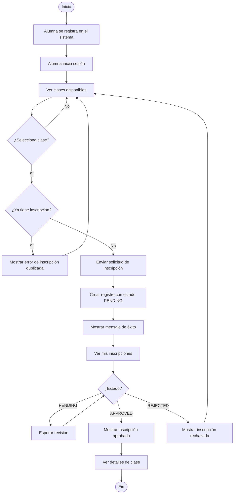
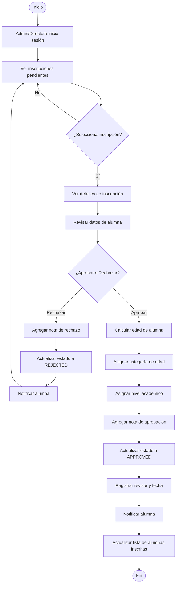
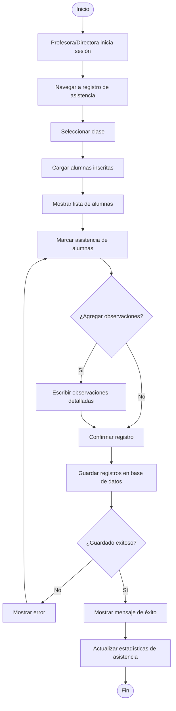
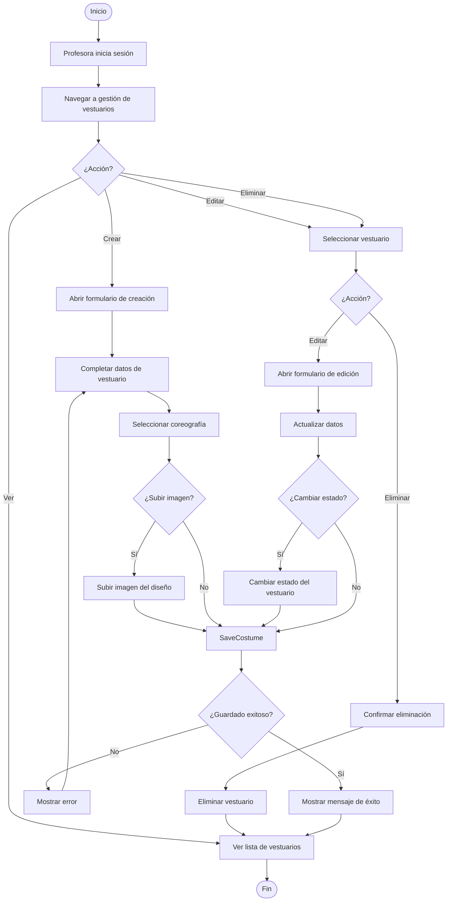
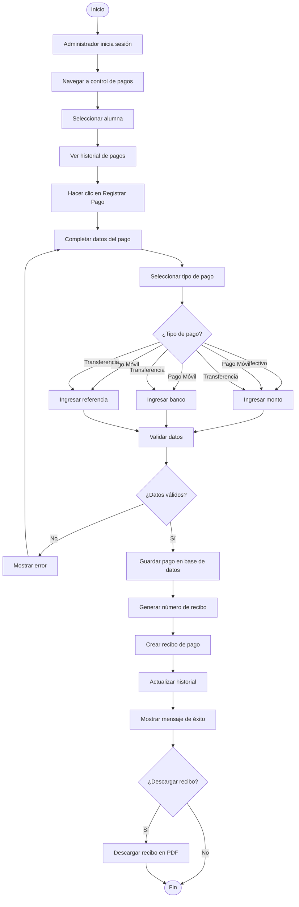
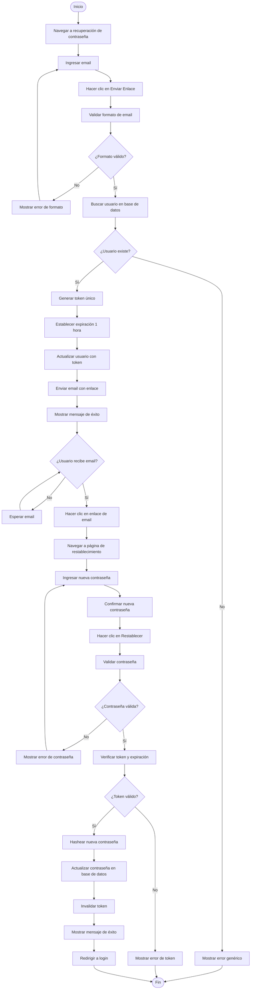
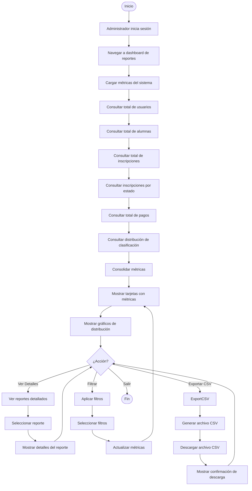
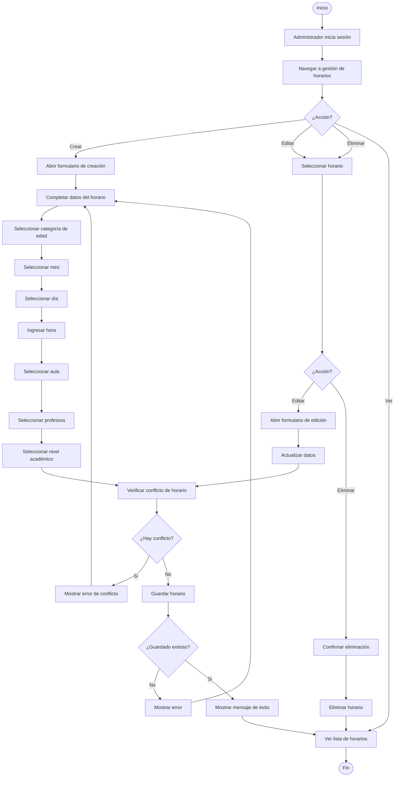

# Diagramas de Actividad del Sistema

## Descripción General

Los diagramas de actividad muestran el flujo de trabajo de los procesos principales del sistema Bellydance Project, representando las acciones, decisiones y caminos alternativos en cada proceso.

## Diagrama de Actividad: Proceso de Inscripción de Alumna



### Descripción del Proceso de Inscripción

1. La alumna se registra en el sistema con sus datos personales
2. La alumna inicia sesión con sus credenciales
3. La alumna navega a ver las clases disponibles
4. La alumna selecciona una clase de interés
5. Si no selecciona clase, vuelve a ver las clases disponibles
6. El sistema verifica si ya tiene una inscripción a esa clase
7. Si ya tiene inscripción, muestra error y vuelve a ver clases
8. Si no tiene inscripción, envía la solicitud de inscripción
9. Se crea un registro de inscripción con estado PENDING
10. Se muestra mensaje de éxito
11. La alumna navega a "Mis inscripciones"
12. El sistema verifica el estado de la inscripción
13. Si está PENDING, espera la revisión
14. Si está APPROVED, muestra la inscripción aprobada y detalles de clase
15. Si está REJECTED, muestra la inscripción rechazada y vuelve a ver clases

## Diagrama de Actividad: Proceso de Revisión de Inscripciones



### Descripción del Proceso de Revisión de Inscripciones

1. El administrador o directora inicia sesión
2. Navega a ver las inscripciones pendientes
3. Selecciona una inscripción para revisar
4. Si no selecciona, sigue viendo las pendientes
5. Si selecciona, ve los detalles de la inscripción
6. Revisa los datos de la alumna
7. Decide si aprobar o rechazar la inscripción
8. Si rechaza:
   - Agrega nota de rechazo
   - Actualiza estado a REJECTED
   - Notifica a la alumna
   - Vuelve a ver inscripciones pendientes
9. Si aprueba:
   - Calcula la edad de la alumna
   - Asigna la categoría de edad automáticamente
   - Asigna el nivel académico
   - Agrega nota de aprobación
   - Actualiza estado a APPROVED
   - Registra el revisor y fecha de revisión
   - Notifica a la alumna
   - Actualiza la lista de alumnas inscritas

## Diagrama de Actividad: Proceso de Registro de Asistencia



### Descripción del Proceso de Registro de Asistencia

1. La profesora o directora inicia sesión
2. Navega al registro de asistencia
3. Selecciona la clase
4. El sistema carga las alumnas inscritas aprobadas
5. Muestra la lista de alumnas
6. La profesora marca la asistencia de cada alumna
7. Decide si agregar observaciones detalladas
8. Si agrega observaciones, escribe las notas
9. Confirma el registro
10. Guarda los registros en la base de datos
11. Verifica si el guardado fue exitoso
12. Si no fue exitoso, muestra error y vuelve a marcar
13. Si fue exitoso, muestra mensaje de éxito
14. Actualiza las estadísticas de asistencia

## Diagrama de Actividad: Proceso de Gestión de Coreografías

```mermaid
flowchart TD
    Start([Inicio]) --> Login[Profesora inicia sesión]
    Login --> NavigateChoreographies[Navegar a gestión de coreografías]
    NavigateChoreographies --> Action{¿Acción?}
    Action -->|Crear| CreateForm[Abrir formulario de creación]
    Action -->|Editar| SelectChoreography[Seleccionar coreografía]
    Action -->|Eliminar| SelectChoreography
    Action -->|Ver| ViewList[Ver lista de coreografías]
    
    CreateForm --> FillData[Completar datos de coreografía]
    FillData --> UploadFiles{¿Subir archivos?}
    UploadFiles -->|Sí| UploadMusic[Subir archivo de música]
    UploadMusic --> UploadVideo[Subir archivo de video]
    UploadVideo --> SaveChoreography
    UploadFiles -->|No| SaveChoreography
    
    SelectChoreography --> Action2{¿Acción?}
    Action2 -->|Editar| EditForm[Abrir formulario de edición]
    EditForm --> UpdateData[Actualizar datos]
    UpdateData --> SaveChoreography[Guardar coreografía]
    Action2 -->|Eliminar| ConfirmDelete[Confirmar eliminación]
    ConfirmDelete --> DeleteChoreography[Eliminar coreografía]
    DeleteChoreography --> ViewList
    
    SaveChoreography --> CheckSave{¿Guardado exitoso?}
    CheckSave -->No| ShowError[Mostrar error]
    ShowError --> FillData
    CheckSave -->|Sí| AssignParticipants{¿Asignar participantes?}
    AssignParticipants -->|Sí| SelectStudents[Seleccionar alumnas]
    SelectStudents --> AddParticipants[Agregar participantes]
    AddParticipants --> ViewList
    AssignParticipants -->|No| ViewList
    
    ViewList --> End([Fin])
```

### Descripción del Proceso de Gestión de Coreografías

1. La profesora inicia sesión
2. Navega a la gestión de coreografías
3. Decide la acción a realizar (crear, editar, eliminar, ver)
4. Si crear:
   - Abre formulario de creación
   - Completa los datos de la coreografía
   - Decide si subir archivos (música, video)
   - Si sube archivos, sube música y video
   - Guarda la coreografía
5. Si editar o eliminar:
   - Selecciona la coreografía
   - Si editar: abre formulario de edición, actualiza datos, guarda
   - Si eliminar: confirma eliminación, elimina coreografía
6. Verifica si el guardado fue exitoso
7. Si no fue exitoso, muestra error y vuelve a completar
8. Si fue exitoso, decide si asignar participantes
9. Si asigna participantes, selecciona alumnas y las agrega
10. Muestra la lista de coreografías

## Diagrama de Actividad: Proceso de Gestión de Vestuarios



### Descripción del Proceso de Gestión de Vestuarios

1. La profesora inicia sesión
2. Navega a la gestión de vestuarios
3. Decide la acción a realizar (crear, editar, eliminar, ver)
4. Si crear:
   - Abre formulario de creación
   - Completa los datos del vestuario
   - Selecciona la coreografía asociada
   - Decide si subir imagen del diseño
   - Si sube imagen, sube el archivo
   - Guarda el vestuario
5. Si editar o eliminar:
   - Selecciona el vestuario
   - Si editar: abre formulario de edición, actualiza datos
   - Decide si cambiar el estado del vestuario
   - Si cambia estado, actualiza el estado
   - Guarda el vestuario
   - Si eliminar: confirma eliminación, elimina vestuario
6. Verifica si el guardado fue exitoso
7. Si no fue exitoso, muestra error y vuelve a completar
8. Si fue exitoso, muestra mensaje de éxito
9. Muestra la lista de vestuarios

## Diagrama de Actividad: Proceso de Registro de Pagos



### Descripción del Proceso de Registro de Pagos

1. El administrador inicia sesión
2. Navega al control de pagos
3. Selecciona una alumna
4. Ve el historial de pagos de la alumna
5. Hace clic en "Registrar Pago"
6. Completa los datos del pago
7. Selecciona el tipo de pago (efectivo, pago móvil, transferencia)
8. Si es pago móvil o transferencia:
   - Ingresa el monto
   - Ingresa el banco
   - Ingresa el número de referencia
9. Si es efectivo:
   - Ingresa el monto
10. Valida los datos ingresados
11. Si los datos no son válidos, muestra error y vuelve a completar
12. Si los datos son válidos, guarda el pago en la base de datos
13. Genera un número único de recibo
14. Crea el recibo de pago asociado
15. Actualiza el historial de pagos
16. Muestra mensaje de éxito
17. Decide si descargar el recibo en PDF
18. Si descarga, genera y descarga el PDF
19. Finaliza el proceso

## Diagrama de Actividad: Proceso de Recuperación de Contraseña



### Descripción del Proceso de Recuperación de Contraseña

1. El usuario navega a la página de recuperación de contraseña
2. Ingresa su email
3. Hace clic en "Enviar Enlace"
4. El sistema valida el formato del email
5. Si el formato no es válido, muestra error y vuelve a ingresar email
6. Si el formato es válido, busca el usuario en la base de datos
7. Si el usuario no existe, muestra error genérico (por seguridad)
8. Si el usuario existe:
   - Genera un token único
   - Establece la expiración del token (1 hora)
   - Actualiza el usuario con el token
   - Envía email con el enlace de recuperación
   - Muestra mensaje de éxito
9. El usuario espera recibir el email
10. Cuando recibe el email, hace clic en el enlace
11. Navega a la página de restablecimiento
12. Ingresa la nueva contraseña
13. Confirma la nueva contraseña
14. Hace clic en "Restablecer"
15. El sistema valida la contraseña
16. Si la contraseña no es válida, muestra error y vuelve a ingresar
17. Si la contraseña es válida, verifica el token y su expiración
18. Si el token no es válido o expiró, muestra error
19. Si el token es válido:
   - Hashea la nueva contraseña
   - Actualiza la contraseña en la base de datos
   - Invalida el token
   - Muestra mensaje de éxito
   - Redirige a la página de login

## Diagrama de Actividad: Proceso de Generación de Reportes



### Descripción del Proceso de Generación de Reportes

1. El administrador inicia sesión
2. Navega al dashboard de reportes
3. El sistema carga las métricas del sistema
4. Consulta el total de usuarios
5. Consulta el total de alumnas
6. Consulta el total de inscripciones
7. Consulta las inscripciones por estado
8. Consulta el total de pagos
9. Consulta la distribución de clasificación académica
10. Consolida todas las métricas
11. Muestra tarjetas con las métricas principales
12. Muestra gráficos de distribución
13. El administrador decide la acción a realizar
14. Si ver detalles: selecciona reporte, muestra detalles
15. Si exportar CSV: genera archivo CSV, descarga, muestra confirmación
16. Si filtrar: selecciona filtros, actualiza métricas, muestra tarjetas
17. Si salir, finaliza el proceso

## Diagrama de Actividad: Proceso de Gestión de Horarios



### Descripción del Proceso de Gestión de Horarios

1. El administrador inicia sesión
2. Navega a la gestión de horarios
3. Decide la acción a realizar (crear, editar, eliminar, ver)
4. Si crear:
   - Abre formulario de creación
   - Completa los datos del horario
   - Selecciona categoría de edad, mes, día, hora, aula, profesora, nivel
   - Verifica si hay conflicto de horario (misma profesora, mismo día, misma hora)
   - Si hay conflicto, muestra error y vuelve a completar
   - Si no hay conflicto, guarda el horario
5. Si editar o eliminar:
   - Selecciona el horario
   - Si editar: abre formulario de edición, actualiza datos, verifica conflicto
   - Si eliminar: confirma eliminación, elimina horario
6. Verifica si el guardado fue exitoso
7. Si no fue exitoso, muestra error y vuelve a completar
8. Si fue exitoso, muestra mensaje de éxito
9. Muestra la lista de horarios

## Resumen de Diagramas de Actividad

| Diagrama | Actor Principal | Decisiones Clave | Salidas |
|----------|----------------|-----------------|---------|
| Inscripción de Alumna | Alumna | ¿Selecciona clase?, ¿Ya tiene inscripción?, ¿Estado? | Inscripción aprobada/rechazada |
| Revisión de Inscripciones | Admin/Directora | ¿Aprobar o Rechazar? | Inscripción actualizada |
| Registro de Asistencia | Profesora/Directora | ¿Agregar observaciones?, ¿Guardado exitoso? | Asistencia registrada |
| Gestión de Coreografías | Profesora | ¿Acción?, ¿Subir archivos?, ¿Asignar participantes? | Coreografía creada/editada |
| Gestión de Vestuarios | Profesora | ¿Acción?, ¿Subir imagen?, ¿Cambiar estado? | Vestuario creado/editado |
| Registro de Pagos | Administrador | ¿Tipo de pago?, ¿Datos válidos?, ¿Descargar recibo? | Pago registrado |
| Recuperación de Contraseña | Usuario | ¿Formato válido?, ¿Usuario existe?, ¿Token válido? | Contraseña restablecida |
| Generación de Reportes | Administrador | ¿Acción? | Reportes generados/exportados |
| Gestión de Horarios | Administrador | ¿Acción?, ¿Hay conflicto? | Horario creado/editado |
