# Diagramas de Secuencia del Sistema

## Descripción General

Los diagramas de secuencia muestran la interacción entre objetos en el tiempo, representando el flujo de mensajes entre los actores y el sistema para los procesos más importantes del sistema Bellydance Project.

## Diagrama de Secuencia: Inicio de Sesión

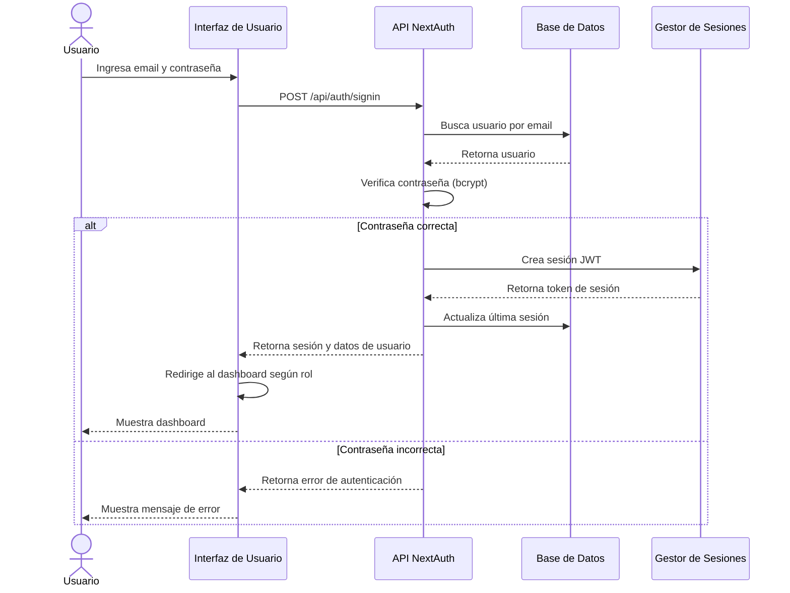

### Descripción del Proceso de Inicio de Sesión

1. El usuario ingresa sus credenciales (email y contraseña) en el formulario de login
2. La interfaz envía una solicitud POST al endpoint `/api/auth/signin`
3. La API busca el usuario en la base de datos por email
4. Si el usuario existe, la API verifica la contraseña usando bcrypt
5. Si la contraseña es correcta:
   - Se crea una sesión JWT
   - Se actualiza la última sesión del usuario
   - Se retorna la sesión y datos del usuario
   - La interfaz redirige al dashboard según el rol del usuario
6. Si la contraseña es incorrecta, se retorna un error y se muestra al usuario

## Diagrama de Secuencia: Registro de Alumna

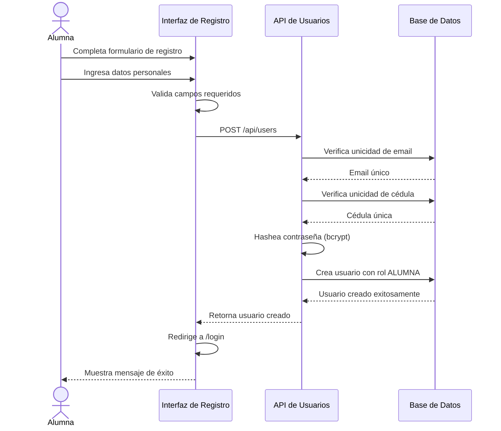

### Descripción del Proceso de Registro de Alumna

1. La alumna completa el formulario de registro con sus datos personales
2. La interfaz valida que todos los campos requeridos estén completos
3. La interfaz envía una solicitud POST al endpoint `/api/users`
4. La API verifica que el email sea único en la base de datos
5. La API verifica que la cédula sea única en la base de datos
6. La API hashea la contraseña usando bcrypt
7. La API crea el usuario con el rol ALUMNA en la base de datos
8. La API retorna el usuario creado
9. La interfaz redirige a la página de login
10. Se muestra un mensaje de éxito a la alumna

## Diagrama de Secuencia: Solicitud de Inscripción

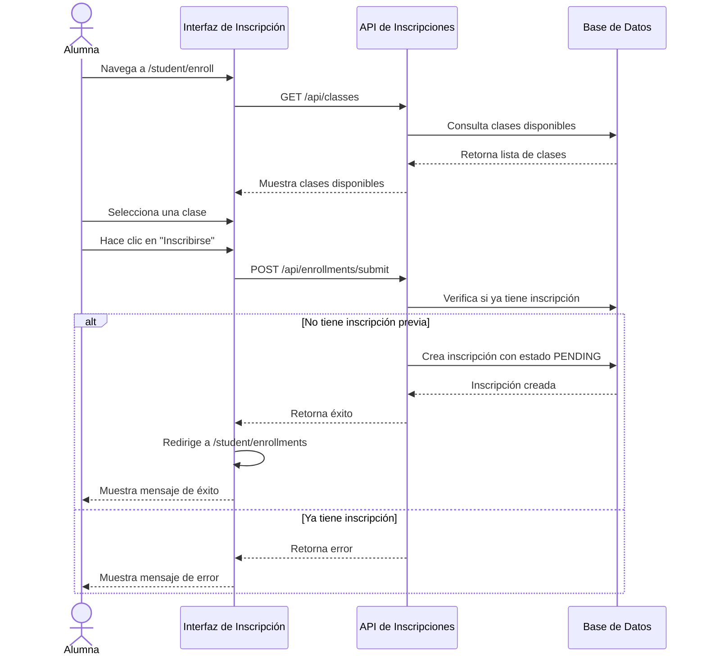

### Descripción del Proceso de Solicitud de Inscripción

1. La alumna navega a la página de inscripción
2. La interfaz solicita las clases disponibles al endpoint `/api/classes`
3. La API consulta la base de datos y retorna la lista de clases
4. La interfaz muestra las clases disponibles
5. La alumna selecciona una clase y hace clic en "Inscribirse"
6. La interfaz envía una solicitud POST al endpoint `/api/enrollments/submit`
7. La API verifica si la alumna ya tiene una inscripción a esa clase
8. Si no tiene inscripción previa:
   - Crea la inscripción con estado PENDING
   - Retorna éxito
   - La interfaz redirige a "Mis inscripciones"
   - Muestra mensaje de éxito
9. Si ya tiene inscripción, retorna error y muestra mensaje

## Diagrama de Secuencia: Revisión y Aprobación de Inscripción

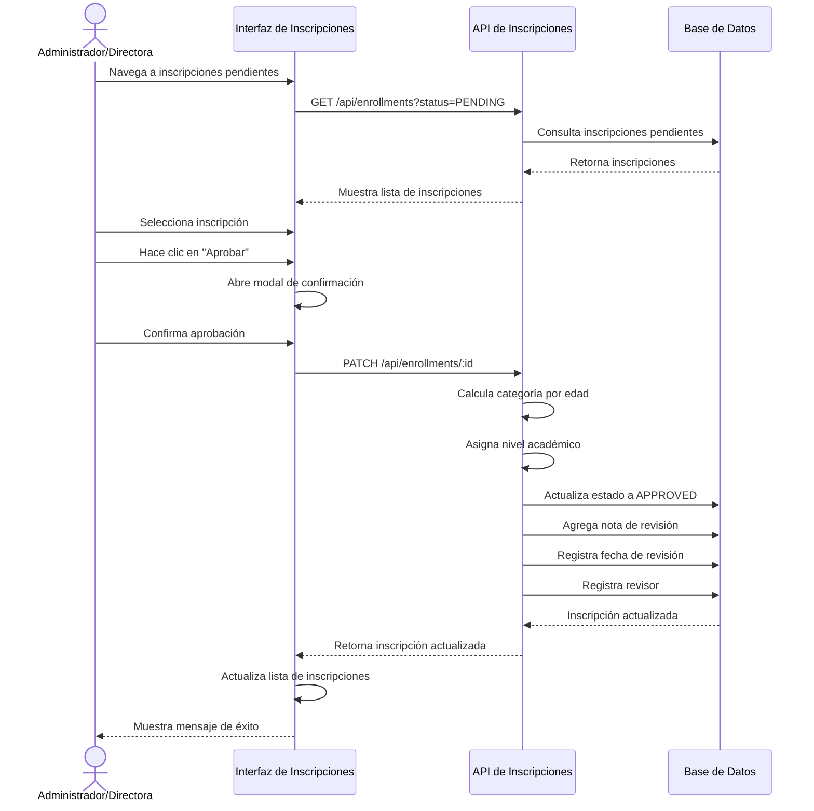

### Descripción del Proceso de Revisión de Inscripción

1. El administrador o directora navega a las inscripciones pendientes
2. La interfaz solicita las inscripciones pendientes al endpoint `/api/enrollments`
3. La API consulta la base de datos y retorna las inscripciones
4. La interfaz muestra la lista de inscripciones
5. El administrador selecciona una inscripción y hace clic en "Aprobar"
6. La interfaz abre un modal de confirmación
7. El administrador confirma la aprobación
8. La interfaz envía una solicitud PATCH al endpoint `/api/enrollments/:id`
9. La API calcula la categoría de edad automáticamente
10. La API asigna el nivel académico
11. La API actualiza el estado a APPROVED en la base de datos
12. La API agrega la nota de revisión
13. La API registra la fecha de revisión y el revisor
14. La API retorna la inscripción actualizada
15. La interfaz actualiza la lista y muestra mensaje de éxito

## Diagrama de Secuencia: Registro de Asistencia

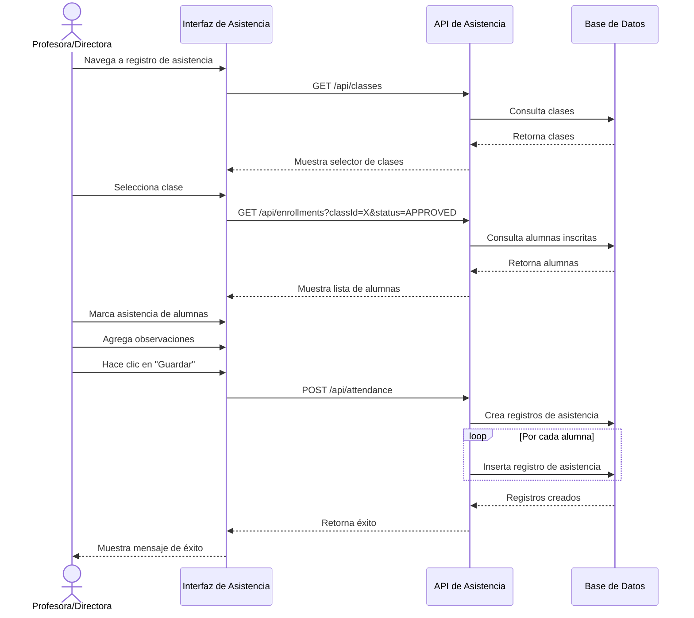

### Descripción del Proceso de Registro de Asistencia

1. La profesora o directora navega al registro de asistencia
2. La interfaz solicita las clases al endpoint `/api/classes`
3. La API consulta la base de datos y retorna las clases
4. La interfaz muestra el selector de clases
5. La profesora selecciona una clase
6. La interfaz solicita las alumnas inscritas aprobadas
7. La API consulta la base de datos y retorna las alumnas
8. La interfaz muestra la lista de alumnas
9. La profesora marca la asistencia de las alumnas
10. La profesora agrega observaciones detalladas
11. La profesora hace clic en "Guardar"
12. La interfaz envía una solicitud POST al endpoint `/api/attendance`
13. La API crea los registros de asistencia en la base de datos
14. La API retorna éxito
15. La interfaz muestra mensaje de éxito

## Diagrama de Secuencia: Gestión de Coreografías

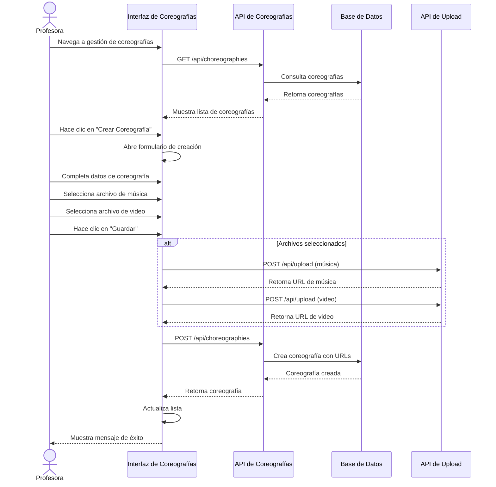

### Descripción del Proceso de Gestión de Coreografías

1. La profesora navega a la gestión de coreografías
2. La interfaz solicita las coreografías al endpoint `/api/choreographies`
3. La API consulta la base de datos y retorna las coreografías
4. La interfaz muestra la lista de coreografías
5. La profesora hace clic en "Crear Coreografía"
6. La interfaz abre el formulario de creación
7. La profesora completa los datos de la coreografía
8. La profesora selecciona archivos de música y video
9. La profesora hace clic en "Guardar"
10. Si hay archivos seleccionados:
    - La interfaz sube la música al endpoint `/api/upload`
    - La interfaz sube el video al endpoint `/api/upload`
11. La interfaz envía una solicitud POST al endpoint `/api/choreographies`
12. La API crea la coreografía con las URLs de los archivos
13. La API retorna la coreografía creada
14. La interfaz actualiza la lista y muestra mensaje de éxito

## Diagrama de Secuencia: Gestión de Vestuarios

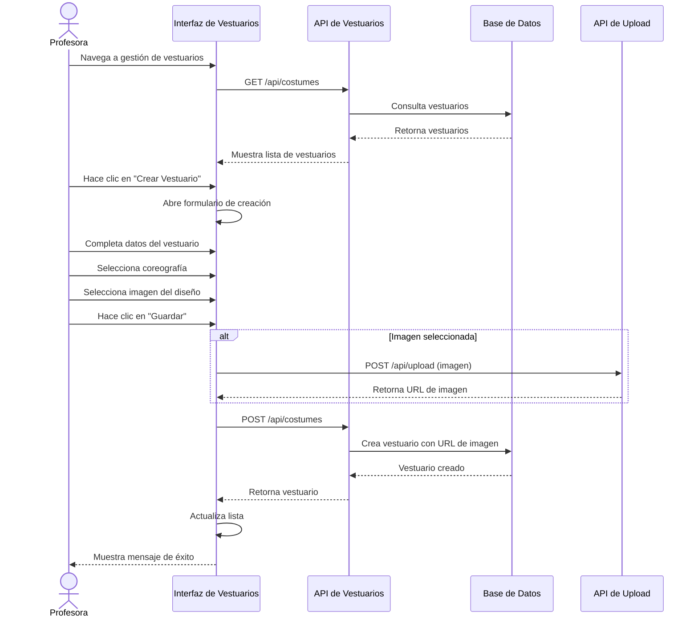

### Descripción del Proceso de Gestión de Vestuarios

1. La profesora navega a la gestión de vestuarios
2. La interfaz solicita los vestuarios al endpoint `/api/costumes`
3. La API consulta la base de datos y retorna los vestuarios
4. La interfaz muestra la lista de vestuarios
5. La profesora hace clic en "Crear Vestuario"
6. La interfaz abre el formulario de creación
7. La profesora completa los datos del vestuario
8. La profesora selecciona la coreografía asociada
9. La profesora selecciona la imagen del diseño
10. La profesora hace clic en "Guardar"
11. Si hay imagen seleccionada:
    - La interfaz sube la imagen al endpoint `/api/upload`
12. La interfaz envía una solicitud POST al endpoint `/api/costumes`
13. La API crea el vestuario con la URL de la imagen
14. La API retorna el vestuario creado
15. La interfaz actualiza la lista y muestra mensaje de éxito

## Diagrama de Secuencia: Registro de Pagos

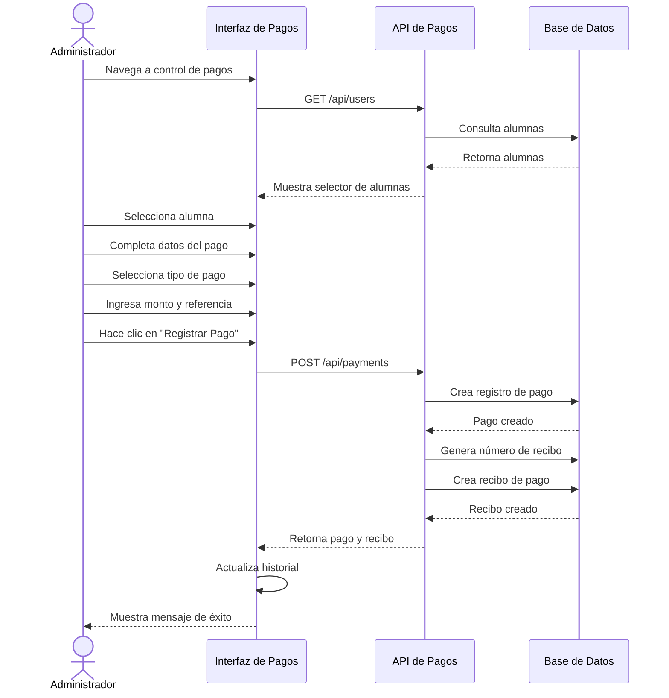

### Descripción del Proceso de Registro de Pagos

1. El administrador navega al control de pagos
2. La interfaz solicita las alumnas al endpoint `/api/users`
3. La API consulta la base de datos y retorna las alumnas
4. La interfaz muestra el selector de alumnas
5. El administrador selecciona una alumna
6. El administrador completa los datos del pago
7. El administrador selecciona el tipo de pago (efectivo, pago móvil, transferencia)
8. El administrador ingresa el monto y número de referencia
9. El administrador hace clic en "Registrar Pago"
10. La interfaz envía una solicitud POST al endpoint `/api/payments`
11. La API crea el registro de pago en la base de datos
12. La API genera un número único de recibo
13. La API crea el recibo de pago asociado
14. La API retorna el pago y el recibo
15. La interfaz actualiza el historial y muestra mensaje de éxito

## Diagrama de Secuencia: Recuperación de Contraseña

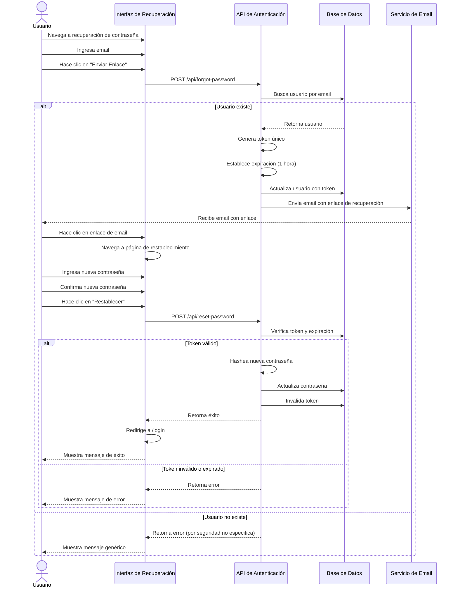

### Descripción del Proceso de Recuperación de Contraseña

1. El usuario navega a la página de recuperación de contraseña
2. El usuario ingresa su email
3. El usuario hace clic en "Enviar Enlace"
4. La interfaz envía una solicitud POST al endpoint `/api/forgot-password`
5. La API busca el usuario por email en la base de datos
6. Si el usuario existe:
   - La API genera un token único
   - La API establece la expiración del token (1 hora)
   - La API actualiza el usuario con el token
   - La API envía un email con el enlace de recuperación
   - El usuario recibe el email
   - El usuario hace clic en el enlace
   - La interfaz navega a la página de restablecimiento
   - El usuario ingresa la nueva contraseña
   - El usuario confirma la nueva contraseña
   - El usuario hace clic en "Restablecer"
   - La interfaz envía una solicitud POST al endpoint `/api/reset-password`
   - La API verifica el token y su expiración
   - Si el token es válido:
     - La API hashea la nueva contraseña
     - La API actualiza la contraseña en la base de datos
     - La API invalida el token
     - La interfaz redirige a login y muestra éxito
   - Si el token es inválido o expirado, muestra error
7. Si el usuario no existe, retorna error genérico (por seguridad)

## Diagrama de Secuencia: Generación de Reportes

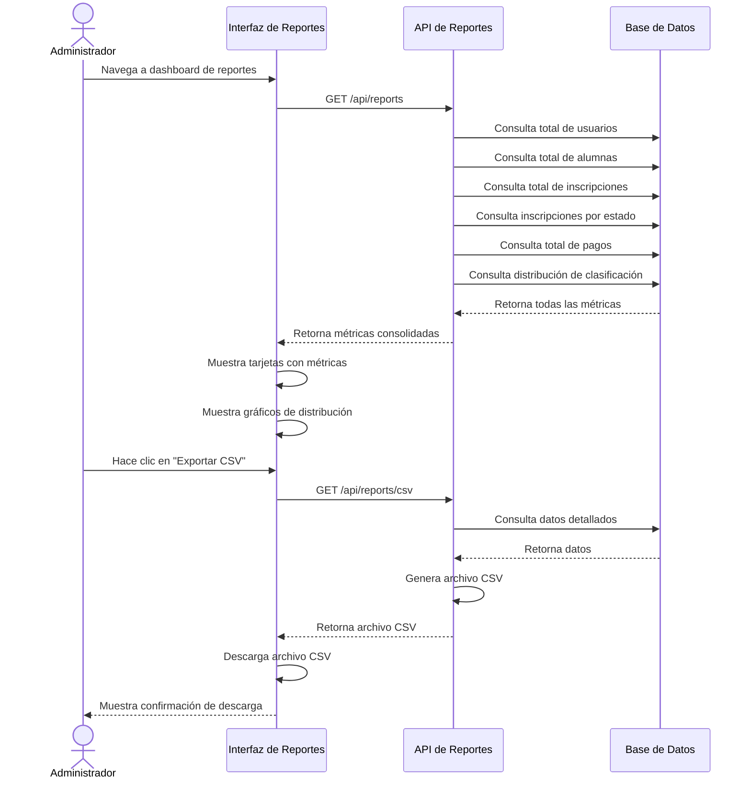

### Descripción del Proceso de Generación de Reportes

1. El administrador navega al dashboard de reportes
2. La interfaz solicita las métricas al endpoint `/api/reports`
3. La API consulta múltiples métricas en la base de datos:
   - Total de usuarios
   - Total de alumnas
   - Total de inscripciones
   - Inscripciones por estado
   - Total de pagos
   - Distribución de clasificación académica
4. La base de datos retorna todas las métricas
5. La API consolida las métricas y las retorna
6. La interfaz muestra tarjetas con las métricas principales
7. La interfaz muestra gráficos de distribución
8. El administrador hace clic en "Exportar CSV"
9. La interfaz solicita el reporte CSV al endpoint `/api/reports/csv`
10. La API consulta los datos detallados en la base de datos
11. La API genera el archivo CSV
12. La API retorna el archivo CSV
13. La interfaz descarga el archivo CSV
14. Se muestra confirmación de descarga al administrador

## Diagrama de Secuencia: Gestión de Horarios

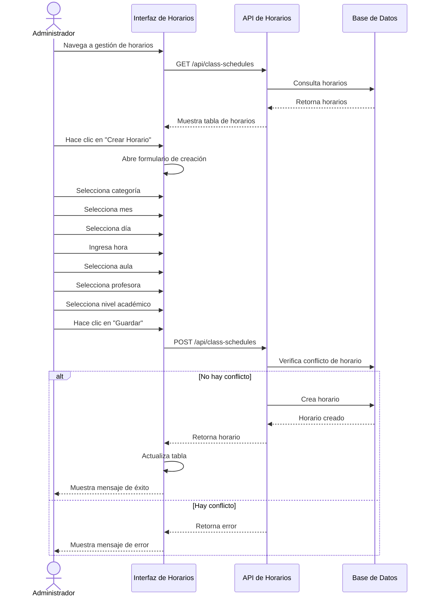

### Descripción del Proceso de Gestión de Horarios

1. El administrador navega a la gestión de horarios
2. La interfaz solicita los horarios al endpoint `/api/class-schedules`
3. La API consulta la base de datos y retorna los horarios
4. La interfaz muestra la tabla de horarios
5. El administrador hace clic en "Crear Horario"
6. La interfaz abre el formulario de creación
7. El administrador selecciona la categoría, mes, día, hora, aula, profesora y nivel
8. El administrador hace clic en "Guardar"
9. La interfaz envía una solicitud POST al endpoint `/api/class-schedules`
10. La API verifica si hay conflicto de horario (misma profesora, mismo día, misma hora)
11. Si no hay conflicto:
    - La API crea el horario en la base de datos
    - La API retorna el horario creado
    - La interfaz actualiza la tabla y muestra éxito
12. Si hay conflicto, retorna error y muestra mensaje

## Resumen de Diagramas de Secuencia

| Diagrama | Actores Principales | Endpoint(s) Principal(es) | Descripción |
|----------|---------------------|---------------------------|-------------|
| Inicio de Sesión | Usuario, API NextAuth | POST /api/auth/signin | Autenticación de usuarios |
| Registro de Alumna | Alumna, API Usuarios | POST /api/users | Creación de cuenta de alumna |
| Solicitud de Inscripción | Alumna, API Inscripciones | POST /api/enrollments/submit | Solicitud de inscripción a clases |
| Revisión de Inscripción | Admin/Directora, API Inscripciones | PATCH /api/enrollments/:id | Aprobación/rechazo de inscripciones |
| Registro de Asistencia | Profesora/Directora, API Asistencia | POST /api/attendance | Registro de asistencia de alumnas |
| Gestión de Coreografías | Profesora, API Coreografías | POST /api/choreographies | Creación y gestión de coreografías |
| Gestión de Vestuarios | Profesora, API Vestuarios | POST /api/costumes | Creación y gestión de vestuarios |
| Registro de Pagos | Administrador, API Pagos | POST /api/payments | Registro de pagos de alumnas |
| Recuperación de Contraseña | Usuario, API Auth | POST /api/forgot-password, POST /api/reset-password | Recuperación segura de contraseña |
| Generación de Reportes | Administrador, API Reportes | GET /api/reports, GET /api/reports/csv | Generación de estadísticas y reportes |
| Gestión de Horarios | Administrador, API Horarios | POST /api/class-schedules | Creación y gestión de horarios |
