# Modelo de Dominio del Sistema

## Descripción General

El modelo de dominio del sistema Bellydance Project representa las entidades principales del negocio y sus relaciones. Este modelo captura la estructura de datos necesaria para gestionar una academia de baile, incluyendo usuarios, clases, inscripciones, asistencia, evaluaciones, coreografías, vestuarios, documentos, pagos y eventos.

## Diagrama de Dominio (Mermaid)

```mermaid
graph TB
    subgraph "Usuarios"
        User[User<br/>Usuario]
        User -->|role| Role1[ADMIN]
        User -->|role| Role2[DIRECTORA_ACADEMICA]
        User -->|role| Role3[PROFESORA]
        User -->|role| Role4[ALUMNA]
    end

    subgraph "Académico"
        Class[Class<br/>Clase]
        Schedule[Schedule<br/>Horario]
        Enrollment[Enrollment<br/>Inscripción]
        Attendance[Attendance<br/>Asistencia]
        Evaluation[Evaluation<br/>Evaluación]
    end

    subgraph "Artístico"
        Choreography[Choreography<br/>Coreografía]
        Costume[Costume<br/>Vestuario]
        ChoreographyParticipant[ChoreographyParticipant<br/>Participante]
    end

    subgraph "Administrativo"
        Document[Document<br/>Documento]
        Payment[Payment<br/>Pago]
        PaymentReceipt[PaymentReceipt<br/>Recibo]
        Event[Event<br/>Evento]
        ClassSchedule[ClassSchedule<br/>Horario de Clase]
    end

    %% Relaciones de Usuario
    User -->|1:N| Enrollment
    User -->|N:1| reviewedEnrollment[Enrollment Reviewed]
    User -->|1:N| taughtClasses[Class Taught]
    User -->|1:N| Attendance
    User -->|1:N| Evaluation
    User -->|1:N| Payment
    User -->|1:N| CostumeInstructor[Costume Designed]
    User -->|1:N| ChoreographyInstructor[Choreography Created]
    User -->|1:N| ChoreographyParticipant
    User -->|1:N| DocumentStudent[Document Student]
    User -->|1:N| registeredDocuments[Document Registered]
    User -->|1:N| ClassScheduleInstructor[ClassSchedule Assigned]

    %% Relaciones Académicas
    Class -->|1:N| Enrollment
    Class -->|1:N| Schedule
    Class -->|1:N| Attendance
    Class -->|1:N| Evaluation

    Enrollment -->|N:1| User
    Enrollment -->|N:1| Class
    Enrollment -->|N:1| reviewedEnrollment

    Schedule -->|N:1| Class
    Attendance -->|N:1| User
    Attendance -->|N:1| Class
    Evaluation -->|N:1| User
    Evaluation -->|N:1| Class

    %% Relaciones Artísticas
    Choreography -->|1:N| Costume
    Choreography -->|1:N| ChoreographyParticipant
    Choreography -->|N:1| ChoreographyInstructor

    Costume -->|N:1| Choreography
    Costume -->|N:1| CostumeInstructor
    ChoreographyParticipant -->|N:1| Choreography
    ChoreographyParticipant -->|N:1| User

    %% Relaciones Administrativas
    Document -->|N:1| User
    Document -->|N:1| registeredDocuments
    Payment -->|N:1| User
    Payment -->|1:1| PaymentReceipt
    PaymentReceipt -->|N:1| Payment

    ClassSchedule -->|N:1| ClassScheduleInstructor

    %% Estilos
    style User fill:#e1f5ff
    style Class fill:#fff4e1
    style Enrollment fill:#fce4ec
    style Choreography fill:#fff9c4
    style Costume fill:#ffe0b2
    style Document fill:#e8f5e9
    style Payment fill:#f3e5f5
    style Event fill:#ffccbc
```

## Entidades del Dominio

### 1. User (Usuario)

Representa a todas las personas que interactúan con el sistema.

**Atributos principales:**
- `id`: Identificador único (CUID)
- `email`: Correo electrónico (único)
- `password`: Contraseña hasheada
- `role`: Rol del usuario (ADMIN, DIRECTORA_ACADEMICA, PROFESORA, ALUMNA)
- `nombre`: Nombre del usuario
- `apellido`: Apellido del usuario
- `cedula`: Número de cédula (único)
- `fechaNacimiento`: Fecha de nacimiento
- `edad`: Edad del usuario
- `direccion`: Dirección física
- `fotoPerfil`: URL de la foto de perfil
- `resetToken`: Token para recuperación de contraseña
- `resetTokenExpires`: Fecha de expiración del token
- `createdAt`: Fecha de creación

**Relaciones:**
- `enrollments`: Inscripciones solicitadas (1:N)
- `reviewedEnrollments`: Inscripciones revisadas (1:N)
- `taughtClasses`: Clases impartidas (1:N)
- `attendances`: Registros de asistencia (1:N)
- `evaluations`: Evaluaciones recibidas (1:N)
- `payments`: Pagos realizados (1:N)
- `costumes`: Vestuarios diseñados (1:N)
- `choreographies`: Coreografías creadas (1:N)
- `choreographyParticipations`: Participaciones en coreografías (1:N)
- `documents`: Documentos como estudiante (1:N)
- `registeredDocuments`: Documentos registrados (1:N)
- `classSchedules`: Horarios asignados (1:N)

### 2. Class (Clase)

Representa una clase de baile impartida en la academia.

**Atributos principales:**
- `id`: Identificador único
- `name`: Nombre de la clase
- `description`: Descripción detallada
- `instructorId`: ID de la profesora
- `supportMaterial`: Material de apoyo (JSON)
- `warmupExercises`: Ejercicios de precalentamiento
- `danceRoutineDescription`: Descripción de la rutina
- `danceTechniqueDescription`: Descripción de la técnica
- `technique`: Técnica trabajada (legacy)
- `topic`: Tema desarrollado (legacy)
- `observations`: Observaciones (legacy)
- `createdAt`: Fecha de creación

**Relaciones:**
- `instructor`: Profesora que imparte la clase (N:1)
- `schedules`: Horarios de la clase (1:N)
- `enrollments`: Inscripciones a la clase (1:N)
- `attendances`: Registros de asistencia (1:N)
- `evaluations`: Evaluaciones de la clase (1:N)

### 3. Schedule (Horario)

Representa los horarios en los que se imparten las clases.

**Atributos principales:**
- `id`: Identificador único
- `classId`: ID de la clase
- `dayOfWeek`: Día de la semana (MONDAY-SUNDAY)
- `startTime`: Hora de inicio (HH:MM)
- `endTime`: Hora de fin (HH:MM)
- `location`: Ubicación
- `createdAt`: Fecha de creación

**Relaciones:**
- `class`: Clase asociada (N:1)

### 4. Enrollment (Inscripción)

Representa la solicitud de una alumna para inscribirse a una clase.

**Atributos principales:**
- `id`: Identificador único
- `studentId`: ID de la alumna
- `classId`: ID de la clase
- `enrollmentDate`: Fecha de solicitud
- `status`: Estado (PENDING, APPROVED, REJECTED)
- `academicLevel`: Nivel académico (BASICO, INTERMEDIO, AVANZADO)
- `ageCategory`: Categoría de edad
- `reviewNote`: Nota de revisión
- `reviewedAt`: Fecha de revisión
- `reviewerId`: ID del revisor
- `createdAt`: Fecha de creación

**Relaciones:**
- `student`: Alumna solicitante (N:1)
- `class`: Clase solicitada (N:1)
- `reviewer`: Usuario que revisó (N:1)

### 5. Attendance (Asistencia)

Representa el registro de asistencia de una alumna a una clase.

**Atributos principales:**
- `id`: Identificador único
- `studentId`: ID de la alumna
- `classId`: ID de la clase
- `date`: Fecha del registro
- `present`: Indica si estuvo presente
- `note`: Nota breve
- `observations`: Observaciones detalladas
- `createdAt`: Fecha de creación

**Relaciones:**
- `student`: Alumna (N:1)
- `class`: Clase (N:1)

### 6. Evaluation (Evaluación)

Representa la evaluación del progreso de una alumna en una clase.

**Atributos principales:**
- `id`: Identificador único
- `studentId`: ID de la alumna
- `classId`: ID de la clase
- `date`: Fecha de evaluación
- `score`: Nota (0-10)
- `comments`: Comentarios
- `progress`: Notas de progreso
- `createdAt`: Fecha de creación

**Relaciones:**
- `student`: Alumna evaluada (N:1)
- `class`: Clase evaluada (N:1)

### 7. Choreography (Coreografía)

Representa una coreografía diseñada para presentaciones.

**Atributos principales:**
- `id`: Identificador único
- `name`: Nombre de la coreografía
- `description`: Descripción
- `level`: Nivel de dificultad
- `music`: URL de la música
- `videoUrl`: URL del video
- `duration`: Duración en minutos
- `status`: Estado (PRACTICE, DEVELOPMENT, READY_FOR_PRESENTATION)
- `instructorId`: ID de la profesora
- `createdAt`: Fecha de creación
- `updatedAt`: Fecha de actualización

**Relaciones:**
- `instructor`: Profesora creadora (N:1)
- `costumes`: Vestuarios asociados (1:N)
- `participants`: Participantes (1:N)

### 8. Costume (Vestuario)

Representa un diseño de vestuario para una coreografía.

**Atributos principales:**
- `id`: Identificador único
- `name`: Nombre del vestuario
- `description`: Descripción
- `color`: Color principal
- `imageUrl`: URL de la imagen
- `accessories`: Accesorios
- `estimatedCost`: Costo estimado
- `status`: Estado (DESIGN, APPROVED, REJECTED, IN_PRODUCTION, COMPLETED)
- `instructorId`: ID de la profesora
- `choreographyId`: ID de la coreografía
- `createdAt`: Fecha de creación
- `updatedAt`: Fecha de actualización

**Relaciones:**
- `instructor`: Profesora diseñadora (N:1)
- `choreography`: Coreografía asociada (N:1)

### 9. ChoreographyParticipant (Participante de Coreografía)

Representa la participación de una alumna en una coreografía.

**Atributos principales:**
- `id`: Identificador único
- `choreographyId`: ID de la coreografía
- `studentId`: ID de la alumna
- `createdAt`: Fecha de creación

**Relaciones:**
- `choreography`: Coreografía (N:1)
- `student`: Alumna participante (N:1)

### 10. Document (Documento)

Representa un documento requerido por las alumnas.

**Atributos principales:**
- `id`: Identificador único
- `studentId`: ID de la alumna
- `type`: Tipo de documento
- `description`: Descripción
- `fileUrl`: URL del archivo
- `receivedDate`: Fecha de recepción
- `deliveryDate`: Fecha de entrega
- `status`: Estado (RECIBIDO, EN_REVISION, APROBADO, RECHAZADO, ENTREGADO)
- `observations`: Observaciones
- `registeredById`: ID del registrador
- `paymentId`: ID del pago asociado
- `createdAt`: Fecha de creación
- `updatedAt`: Fecha de actualización

**Relaciones:**
- `student`: Alumna (N:1)
- `registeredBy`: Usuario que registró (N:1)

### 11. Payment (Pago)

Representa un pago realizado por una alumna.

**Atributos principales:**
- `id`: Identificador único
- `studentId`: ID de la alumna
- `paymentDate`: Fecha de pago
- `amount`: Monto
- `paymentType`: Tipo (EFECTIVO, PAGO_MOVIL, TRANSFERENCIA)
- `referenceNumber`: Número de referencia
- `bank`: Banco
- `receipt`: Recibo asociado
- `createdAt`: Fecha de creación

**Relaciones:**
- `student`: Alumna (N:1)
- `receipt`: Recibo del pago (1:1)

### 12. PaymentReceipt (Recibo de Pago)

Representa el recibo de un pago.

**Atributos principales:**
- `id`: Identificador único
- `receiptNumber`: Número de recibo (único)
- `paymentId`: ID del pago
- `issueDate`: Fecha de emisión
- `status`: Estado (PAGADO)
- `createdAt`: Fecha de creación
- `updatedAt`: Fecha de actualización

**Relaciones:**
- `payment`: Pago asociado (1:1)

### 13. Event (Evento)

Representa un evento académico.

**Atributos principales:**
- `id`: Identificador único
- `name`: Nombre del evento
- `description`: Descripción
- `eventDate`: Fecha del evento
- `location`: Ubicación
- `createdAt`: Fecha de creación

### 14. ClassSchedule (Horario de Clase)

Representa los horarios de clases por categoría y nivel.

**Atributos principales:**
- `id`: Identificador único
- `category`: Categoría de edad
- `month`: Mes
- `day`: Día de la semana
- `time`: Hora (HH:MM)
- `classroom`: Aula
- `instructorId`: ID de la profesora
- `academicLevel`: Nivel académico
- `createdAt`: Fecha de creación
- `updatedAt`: Fecha de actualización

**Relaciones:**
- `instructor`: Profesora asignada (N:1)

## Enumeraciones

### Role (Rol de Usuario)
- `ADMIN`: Administrador del sistema
- `DIRECTORA_ACADEMICA`: Directora artística
- `PROFESORA`: Profesora de baile
- `ALUMNA`: Estudiante

### EnrollmentStatus (Estado de Inscripción)
- `PENDING`: Pendiente de revisión
- `APPROVED`: Aprobada
- `REJECTED`: Rechazada

### DayOfWeek (Día de la Semana)
- `MONDAY`: Lunes
- `TUESDAY`: Martes
- `WEDNESDAY`: Miércoles
- `THURSDAY`: Jueves
- `FRIDAY`: Viernes
- `SATURDAY`: Sábado
- `SUNDAY`: Domingo

### PaymentType (Tipo de Pago)
- `EFECTIVO`: Efectivo
- `PAGO_MOVIL`: Pago móvil
- `TRANSFERENCIA`: Transferencia bancaria

### CostumeStatus (Estado de Vestuario)
- `DESIGN`: En diseño
- `APPROVED`: Aprobado
- `REJECTED`: Rechazado
- `IN_PRODUCTION`: En producción
- `COMPLETED`: Completado

### ChoreographyStatus (Estado de Coreografía)
- `PRACTICE`: En práctica
- `DEVELOPMENT`: En desarrollo
- `READY_FOR_PRESENTATION`: Lista para presentación

### AcademicLevel (Nivel Académico)
- `BASICO`: Básico
- `INTERMEDIO`: Intermedio
- `AVANZADO`: Avanzado

### AgeCategory (Categoría de Edad)
- `MINI_BELLYDANCE`: 4-11 años
- `BELLYDANCE_ADOLESCENTES`: 12-17 años
- `BELLYDANCE_ADULTAS`: 18+ años

### Month (Mes)
- `ENERO` a `DICIEMBRE`: Meses del año

### DocumentType (Tipo de Documento)
- `PLANILLA_INSCRIPCION`: Planilla de inscripción
- `CEDULA_IDENTIDAD`: Cédula de identidad
- `FOTO_CARNET`: Foto carnet
- `CONSTANCIA_INSCRIPCION`: Constancia de inscripción
- `RECIBO_PAGO`: Recibo de pago
- `CERTIFICADO`: Certificado
- `OTRO`: Otro

### DocumentStatus (Estado de Documento)
- `RECIBIDO`: Recibido
- `EN_REVISION`: En revisión
- `APROBADO`: Aprobado
- `RECHAZADO`: Rechazado
- `ENTREGADO`: Entregado

## Reglas de Negocio

### Clasificación Automática
- Las alumnas se clasifican automáticamente por edad al aprobar la inscripción:
  - 4-11 años: MINI_BELLYDANCE
  - 12-17 años: BELLYDANCE_ADOLESCENTES
  - 18+ años: BELLYDANCE_ADULTAS

### Unicidad
- Email debe ser único en el sistema
- Cédula debe ser única en el sistema
- Una alumna no puede tener múltiples inscripciones aprobadas a la misma clase
- Una alumna solo puede participar una vez en una coreografía

### Estados de Inscripción
- Las inscripciones comienzan en estado PENDING
- Solo ADMIN y DIRECTORA_ACADEMICA pueden cambiar el estado
- Al aprobar, se asigna automáticamente academicLevel y ageCategory

### Horarios
- Una profesora no puede tener clases en el mismo día y hora (restricción única)
- Los horarios se pueden filtrar por categoría, nivel, profesora, día y mes

## Flujo de Datos

1. **Registro**: Alumnas se registran → User creado con rol ALUMNA
2. **Inscripción**: Alumna solicita clase → Enrollment creado con estado PENDING
3. **Revisión**: Admin/Directora aprueba → Enrollment cambia a APPROVED con clasificación
4. **Asistencia**: Profesora/Directora registra → Attendance creado
5. **Evaluación**: Profesora evalúa → Evaluation creado
6. **Coreografía**: Profesora crea → Choreography creado
7. **Participación**: Profesora asigna alumnas → ChoreographyParticipant creado
8. **Vestuario**: Profesora diseña → Costume creado
9. **Pago**: Admin registra → Payment y PaymentReceipt creados
10. **Documento**: Alumna sube → Document creado con estado RECIBIDO
